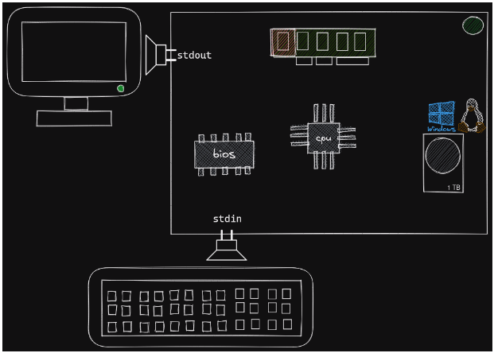
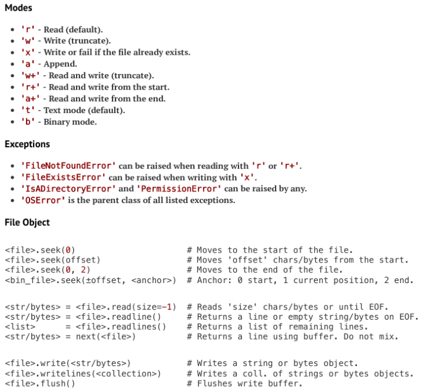
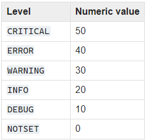
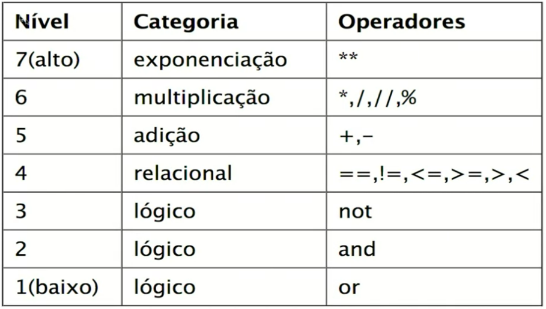

# Repositório de códigos e anotações do curso de python base da linuxtips

## Comandos

### Linux

`cat arquivo`: mostra todo o conteúdo em forma de texto do arquivo em questão.
`tail -f arquivo`: fica "observando" o arquivo, mostrando alterações em tempo real.
`mkdir pasta`: cria uma pasta
`cd pasta`: acessa uma pasta
`pwd`: mostra o caminho da pasta atual
`touch arquivo`: cria um arquivo em branco
`ls`: listar arquivos
`echo "Texto" >> arquivo`: escreve em um arquivo. Usando ">" ele abre no modo de "write" substituindo todo o conteúdo do arquivo ao escrever. Usando ">>" ele abre no modo de "append" e não substitui o conteúdo já colocado no arquivo, apenas adiciona ao final.
`cat arquivo`: ler o conteúdo de um arquivo

### Console

`python -c "comando"`: executa comandos Python no terminal
`ipython -i script.py`: rode o programa e um terminal fica aberto no final, com todos os objetos criados no programa disponíveis para uso.
`python -m site`: módulo que mostra como o Python que está sendo usado está instalado. Para executar outros módulos: `python -m nome_do_modulo`.
`python --version`: mostra versão instalada do Python
`python -VV`: mostra a versão instalada e o momento em que o Python foi compilado.
`python --help`: mostra a guia de ajuda.
`python`: terminal interativo do Python (interpretador).
`python -m turtledemo`: pacote gráfico com exemplos
`which python`: mostra o caminho do python que o sistema está usando.
`mv nome_arquivo nome_novo`: renomeia um arquivo
`env`: mostra a lista de todas as variáveis do ambiente.
`env | grep variavel_ambiente`: grep é uma ferramenta de filtragem do linux.
`export variavel_ambiente`: altera o valor de uma variável de ambiente.
`unset variavel_ambiente`: exclui uma variável de ambiente.
`variavel_ambiente script`: força um script a atualizar um determinado valor de uma determinada variável de ambiente.
`python3.11 -m venv nome_ambiente_virtual`: comando para criar um ambiente virtual.
`source .venv/bin/activate`: comando para ativar um ambiente virtual no Linux bash.
`deactivate`: comando para sair do ambiente virtual

### Funções Python

`bin(numero_inteiro)`: função que mostra a versão binária de determinado número inteiro.
`chr(numero_inteiro)`: função que retorna um caractere referente a um número inteiro.
`id(variavel)`: função que retorna a posição na memória RAM de uma determinada variável.
`type(variavel)`: função que retorna o tipo de dado de uma variável.
`int(valor)`: força a um valor a ser do tipo inteiro.
`dir(tipo_de_dado)`: função que retorna a implementação do objeto, tudo que é possível ser feito com objetido de um determinado tipo de dado.
`str(variavel)`: converte uma variável para String.

`variavel.encode("utf-8")`: retorna um objeto do tipo bytes, onde separado por cada "\" terá um byte formando uma série de bytes que representa um caractere Unicode.
`variavel.decode()`: converte a série de bytes para um caractere Unicode.
`bytes(variavel, "utf-8")`: converte um texto para uma sequência de bytes usando uma tabela específica para buscar o texto.

`len()`: retorna a quantidade de itens dentro de uma sequência materializadas. Método `__len__()`.
`next()`: retorna o próximo item de um objeto composto.
`upper()`: transforma todos os caracteres em maiúsculos.
`lower()`: transforma todos os caracteres em minúsculos.
`capitalize()`: transforma a primeira letra da String em maiúscula.
`title()`: transforma todas as primeiras letras de cada palavra da String em maiúscula.
`split()`: divide um texto em uma lista separadas onde cada espaço é uma palavra.
`startswith("letra")`: verifica se o texto começa com determinada letra, retorna true ou false.
`endswith("letra")`: verifica se determina letra está no final do text, retorna true ou false.
`sorted()`: retorna a ordenação de uma string baseada em uma tabela ASCII.
`reversed()`: retorna uma string ao contrário.
`print("\U0001F43C")`: imprime um emoji com base no seu código Unicode.
`print("\N{panda face})`: imprime um emojo com base no seu nome na tabela Unicode.

`tuple.count("valor")`: informa a quantidade que tem dentro de uma tupla de um determinado valor.

`list.append("Valor")`: adiciona um elemento ao final da lista.
`list.insert(posição, "Valor")`; adiciona um elemento a uma posição específica.
`list.remove("Valor")`: remove um elemento da lista, caso haja mais de um valor igual, ele irá remover o primeiro valor.
`list.pop()`: remove elemento por elemento a partir do fim.
`list1.extend(list2)`: extende/adiciona uma lista a outra.

### Métodos Dunder e Públicos

`__add__()`: implementa o protocolo de adição, sendo um objeto Aditivel. Exemplo: `numero.__add__(1) = numero + 1`.
`__sub__()`: implementa o protocolo de subtração, sendo um objeto redutivel. Exemplo: `numero.__sub__(1) = numero - 1`.
`__mul__()`: implementa o protocolo de multiplicação, sendo um objeto multiplicável. Exemplo: `numero.__mul__(2) = numero * 2`.
`__eq__()`: implementa o protocolo de equalidade. Exemplo: `numero.__eq__(2) = numero == 2`.
`__getitem__()`: habilidade de ser fatiado.
`__contains__`: verifica se possui determinado valor de uma lista ou tupla. Em alguns casos ele pode ser lento. Exemplo: `8 in numeros`

### iPython

`%time função`: comando do iPython que demonstra o uso do CPU para executar determinada função.

## Introdução a programação e ao Python - Day 1

### Linguagens de programação

#### Input e Output (I/O)

__Input:__ envia dados para a unidade computacional, instruções
__Output:__ recebe dados processados do computador, em diversos formatos

__Binário:__ base númerica em que o computador realiza as operações. Basicamente, os dígitos 1 e 0:
1: ligado
0: desligado

- Padronização em formato de bits para se comunicar com a máquina
- Conjunto de 8, 16, 32 bits, formando mensagens específicas
- 8 bits formam 1 byte

__Exemplo:__ letra A = 65 = 01000001

#### Linguagem de programação

Abstração, forma mais natural ao entendimento humano de escrever, aprender e memorizar.

- __Linguagem de baixo nível (Assembly):__ nível mais próximo ao processador/hardware
- __Linguagem de médio nível (C):__ camada nem tanto abstrata e nem tão próxima do processador/hardware
- __Linguagem de alto nível (Python):__ camada mais abstrata, mais fácil para programar.

Uma linguagem de alto nível é convertida para o nível médio e depois então para o baixo nível.

__Linguagens compiladas:__ escreve o programa e o programa precisa estar todo correto do início ao fim. O compilador junta toda a lógica e forma um tipo "pacote" para executar o software. (simplificado)

__Linguagens interpretadas:__ cada comando/linha é interpretado de forma individual.

__O código compilado__ para funcionar em diferentes sistemas operacionais é necessário compilar um pacote para cada sistema.
__O código interpretado__ geralmente é multi plataforma pois ele é interpretado na hora que é executado.

Python é uma linguagem dinâmica e interpretada.

#### Programa

Conjunto de instruções colocados de forma organizada em um ou mais arquivos e que podem ser executados várias vezes obtendo os mesmos resultados. Existem 2 categorias de programas:

- __Programas compilados:__ exigem que todas as linhas de código sejam avaliadas e validadas antes do programa executável ser gerado já na linguagem de máquina e no momento da execução o programa está todo pronto para rodar.
- __Programas interpretados:__ aqueles que podem ser escritos em arquivos mas são avaliados linha a linha, bloco a bloco, sem a necessidade de o programa inteiro estar avaliado, cada instrução é lida e logo em seguida interpreta e executada, tornando mais fácil e mais dinâmica a programação, mas pode ser também mais suscetível a erros.

### Como está organizada a plataforma Python

Python é uma plataforma formada por uma série de componentes.

#### PLR - Python Language Reference

- Documento contendo toda a especificação da linguagem, extenso conjunto de textos escrito pelo criador do Python.
- Regras gramaticais da linguagem.
- Palavras reservadas.
- Todos os comportamentos esperados de uma implementação de Python.

#### Implementação

__CPython__ - Implementação oficial escrita em linguagem C do Python

A partir da PLR se cria uma implementação do Python, essa especificação é programada com o objetivo de interpretar e executar programas Python, como:

- IronPython (.NET)
- Jython (Java Virtual Machine)
- PyPy (escrito em Python para ser mais rápido)
- Stackless Python (CPython com suporte microthreads)
- MicroPython (micro controllers)

#### Ecossistema

Tudo em torno da linguagem Python.

- Comunidades
- PSF (Python Software Foundation)
- Pacotes e ferramentas
- pypi.org (Python Package Index), através da ferramenta `pip` que se instala os pacotes.

### Instalação do Python e preparação do ambiente

Python como uma entidade e você "conversa" com ele, sempre vai ter uma resposta.

Valores que o Python compreende mas não sabe tomar uma ação são chamados de literais.

No interpretador Python, ele sempre vai imprimir os comandos inseridos.

REPL - read-eval-print loop (laço de leitura, execução e impressão)

### Introdução ao git e seu primeiro script Python

Script Python é um arquivo aonde se tem comandos, cada linha para o interpretador é entendido como um comando diferente. Arquivo isolado que pode ser executado isoladamente.

#### Shebang (ambientes Linux)

Comentário especial, sempre na primeira linha, usado para especificar um interpretador específico para o progrmama.

### Criando um programa que lê variáveis de ambiente

#### Variáveis de Ambiente

Termo usado para referir ao local onde o programa é executado, o ambiente em termos gerais é formado por um shell que pode ser entendido como um local isolado onde o seu programa executa.
Neste ambiente existem variáveis que servem para configurar o comportamento do próprio ambiente, do sistema e dos programas que rodam.

__Condicionais:__ define um teste e sempre se usa junto com uma expressão de comparação.

Guia de estilo do python: pep8.org

Manter 80 colunas por linha, uma boa prática.

- __Snake case:__ current_language
- __Pascal Case:__ CurrentLanguage

__Built-in:__ algo que já vem imbutido na linguagem.
__Biblioteca padrão:__ tudo aquilo que já vem instalado por padrão no Python.

### Tipos de instruções: expressions, statements, assignment

Tipos de instruções que podem ser passadas para o interpretador do Python.

- __Expression/Expressão:__ instrução que espera um valor de retorno. Exemplo: 1 + 1
- __Statement/Declaração:__ instrução que prepara o interpretador para uma determinada tarefa mas não retorna valor, normalmente acompanhado de uma expressão. Exemplo: if, else, for, while, pass
- __Assignment/Atribuição:__ intrução que pega o retorno de uma expressão e processa o seu valor com intuito de armazenar. Exemplo: soma = 40 + 2, soma += 3

__Protocolo:__ o que o objeto é capaz de fazer.

#### A precedência de operadores no Python

Além da precedência de operadores aritméticos PEMDAS também existe a tabela de precedência de operadores da própria linguagem:

|   __Nível__  |   __Categoria__   |   __Operadores__   |
|:--------:|:-------------:|:---------------:|
|  7(alto) | Exponenciação |        **       |
|     6    | Multiplicação |     *,/,//,%    |
|     5    |     Adição    |       +,-       |
|     4    |   Relacional  | ==,!=,<=,>=,>,< |
|     3    |     Lógico    |       not       |
|     2    |     Lógico    |       and       |
| 1(baixo) |     Lógico    |        or       |

### Bloco de código e identação

Linguagem fácil de ser entendida por pessoas que não são programadores.

Tarefa: fazer compras
Lista de compras, categorias/blocos

__Blocos de código lógicos:__ possui um escopo definido.
Os ":" inidica um início de um bloco de código, sendo o recúo obrigatório.

__Identação:__ termo usado para a formatação da lista de compras por exemplo, após cada categoria ou seção colocamos um recuo antes de começar o conteúdo.

### Ambientes virtuais e ferramenta iPython

__Ambiente real:__ ambiente onde se encontra o Python do sistema operacional.

#### Ambientes virtuais

- É uma sandbox, é uma cópia de todo o ambiente Python.
- Garante que as dependências e o programa como um todo funcione de forma igual e correta em qualquer computador, evitando conflitos e danos. Cada projeto terá um ambiente virtual.

__Convenção Linux:__ Todo arquivo/pasta que tem um ponto no início é um arquivo/pasta oculto.

__Pip:__ busca pacotes em repositórios para ser instalado no Python. Busca em pypi.org

__iPython:__ interpretador Python com mais ferramentas e colorido.

## Tipos de dados e protocolos - Day 2

### A importância dos tipos de dados e os tipos de dados primitivos

Classe, categoria e tipo são as mesmas coisas. Apesar de terem suas diferenças.

Todo objeto do Python possui as mesmas características, um objeto contém um endereço de memória, que contém um tipo/classe/categoria e um valor.

Através do tipo de dado que o Python consegue saber qual informação você quer, sendo um número, uma letra ou outras coisas.

Através do tipo que é possível converter um dado em uma informação.

#### Tipos de dados primários (Scalar Types)

Utilizados para armazenar uma única unidade de informação como por exemplo um número ou um texto.

- __Métodos públicos:__ métodos que não possuem dunder, podem ser usados diretamente.
- __Protocolos:__ métodos dunder/especiais, determina uma operação que um objeto dentro de um tipo de dado pode tomar, só o Python deve usar, nós devemos usar abstrações que por baixo chamaram esses métodos, exemplos:

#### Tipo de dado Integer

Armazena os números inteiros em Python e é representado pela classe int. Exemplo: `numero = 65`.

#### Tipo de dado Float

- Armazena um valor fracionado, além da parte inteira também armazena o ponto flutuante, a fração, como resultados de divisões. Exemplo: `valor = 5 / 2`.
- A presença de um ponto (".") faz que o Python entenda esse número como um Float.
- Para trabalhar com valores monetários, em uma aplicação de verdade, usa o tipo de dado Decimal ou Currency.

#### Tipo de dado Booleanos

- Armazena um valor True (verdade, 1) ou False (falso, 0). Serve para criação de flags.
- O if só trabalha com valores Booleanos.
- Qualquer número diferente de 0 ou texto não vazio é considerado True para o Python.
- Usado para apresentar uma sintaxe mais bonita. Mas por baixo o Python interpreta 0 como False e 1 como True.

#### Tipo de dado NoneType

- Possui apenas uma única opção de valor, "None", significa nulo, ausência de valor.
- Usado para criar uma variável que não se sabe o valor. Possui um endereçamento de memória e um tipo. O valor da variável pode ser redefinido.
- NoneType é um objeto Singleton, durante toda a execução do código, só pode ser criado apenas uma única vez, só pode existir apenas um único objeto.
- Uma função que não tem um retorno explícito sempre irá retornar um valor NoneType.

O próprio Range é um tipo de dado, ele gera um tipo de dado.
Protocolo Iterable (percorrível), pode percorrer cada um dos seus itens e realizar uma operação. For = Para.

### Textos, Caracteres, Encoding e Strings

- Bytes para Inteiro e Inteiro para Caractere.
- Tipo entre o tipo primário e o tipo composto
- Quando se está armazenando cada uma das letras com seus respectivos butes e sequência posicional em um único objeto, temos o que se chama de Byte Array, no caso do Python se chama String.

__ASCII (American Standard Code for Information Interchange)__ é uma tabela Americana, e por limitação de memória ela só tem 128 (0-127) posições. Deixa de fora muitos caracteres especiais de outras linguas.

__Unicode (Universal Code)__ tabela onde vai existir todos os caracteres existentes. unicode.org

O Python permite imprimir diretamente um caractere na tela.

__Tabela UTF8:__ tabela Unicode que possui 8 bytes para cada posição. Existem caracteres que ocupam mais de 8 bytes.

Em Python, números começados com "0b" são binários e "0x" são hexadecimais.

#### Serialização

Usado para converter um caractere Unicode para uma String de caracteres mais simples, como Hexadecimais, usado para trafegar dados ou armazenar dados.

#### Formatação de textos

##### Concatenação

- Junção de duas Strings em uma. Exemplo: `"Geovanne" + "Padilha"`.
- Tipagem dinâmica, mas tipagem forte, necessita garantir que os tipos de dados são compatíveis.
- Usada na biblioteca logging do Python.

Se tem poucos textos, um texto no começo e um no final, é um bom caso para se utilizar concatenação, mas quando se tem mais blocos de Strings, é bom usar a interpolação.

##### Interpolação (Old Style)

- Uso de template, que vai conter o texto e os placeholder, para ser substituido por dado em uma variável. Exemplo:

`template = "Olá, %s seu saldo é de %f"`.

Para substituir no template usa: `template % (variavel, variavel)`. Os dados sempre inseridos na ordem da esquerda para direita no template.

##### Tipos de placeholder

`%s`: local para ser substituido por um texto, uma String.
`%d`: local para ser substituido por um dígito, um Int.
`%03d`: um dígito sendo exibido com 3 casas decimais.
`%f`: local para ser substituido por um ponto flutuante, um Float.
`%.2f`: ponto flutuante com duas casas decimais.

Pode ser passado diretamente: `"Olá %s" % "Geovanne"`.
Informações sobre formatações no Python: pyformat.info

`%(nome)s`: atribuindo um nome para um placeholder.

Para passar um valor para um placeholder com nome se usa um dicionário. Exemplo: `template = {"nome": nome}`

##### String Format (New Style)

- Usa uma String como um template e substitui as informações na String.
- Usado em mensagens longas.

Em vez da "%" usa as "{}". Exemplo: `msg = "Olá, {} você é o player n {} e você tem {} pontos`.

Para atribuir os valores aos placeholders: `msg.format("Bruno", 2, 987.3)`.

`{:03d}`: específica que é um número inteiro com 3 casas.
`{:.3f}`: específica que é um número de ponto flutuante com 3 casas depois da vírgula.
`{:^11}`: centraliza o texto em um total de 11 caracteres.
`{:<20}`: coloca 20 espaços em branco no total e o texto alinhado a esquerda.
`{:>20}`: coloca 20 espaços em branco no total e o texto alinhado a direita.
`{:-^11}`: preenche os 11 espaços em branco com traços.
`{:#^20.3}`: preenche os espaços em branco com "#", centraliza em 20 caracteres no total e corta 3 caracteres do texto.

Também é possível colocar nomes para os placeholders. Exemplo: `{nome}`.
Para atribuir os valores aos placeholders com nomes: `template.format(nome="Bruno")`.

##### F-Strings - Um String Format melhorado

- Usada para qualquer mensagem, print, erros etc.

Exemplo: `f"Olá {nome} você tem {saldo:.2f}"`

Toda f-string criada deve ter variáveis existentes associadas.
Toda formatação no F-Strings funciona do mesmo jeito que no String Format.

Dentro do bloco de f-string pode ser realizado algumas operações, como: `{n1 * n2}`.

`\n`: quebra de linha no Python

### Tipos de dados Compostos

#### Sequência (Sequence)

- Um só objeto na memória que pode ser atribuído um nome, e dentro desse objeto terá posições para cada objeto.
- O objeto sequência não vai ter valor para cada objeto dentro dele, mas sim referências, apontandos para determinados espaços na memória que contém os dados.

O tipo composto é um agrupamento onde dentro dele será guardado referências para múltiplos objetos

#### Tuplas (Tuple)

Exemplo: `dados = "Bruno", 2, 3.50, True`

Tipo composto mais simples e bastante comum no Python.
Cria uma sequência de valores que podem ser de qualquer tipo. Pode ser criado com ou sem parênteses.
Sempre que um ou mais objetos forem encadeados com `,`, isso será interpretado como um objeto do tipo tupla.
É imutável, após ser criada os valores dentro dela não podem ser alterados ou adicionados novos valores.

`dados[-1]`: subscrição, com o método de acesso pelo índice, sendo possível da frente `dados[0]` ou de trás `dados[-2]`.
Também é possível fatiar uma Tupla. Exemplo: `dados[1:3]`

##### Desempacotamento (Unpacking, Spread, Explode)

```python
# Empacotamento (atribuição)
coord = 140, 200, 9

# Desempacotamento (atribuição múltipla)
x, y, z = coord
```

Desempacotar cada valor de uma Tupla em variáveis separadas. Desempacota da esquerda para a direita

Selecionar apenas o valor desejado: `x, *_ = pontos`. Nesse caso, o Python vai colocar o primeiro valor em "x" e o restante no "_" (underline).
Selecionar apenas o primeiro e o último elemento: `x, *_, y = coord`

#### Listas (Lists)

- Objeto mais padrão para se tratar de sequência.
- As listas são mais flexíveis, podendo ser comparadas com arrays ou vetores.
- Pode ser criada vazia ou com elementos, por ser mutável, possui tamanho dinâmico, podendo remover ou adicionar novos elementos e reordenação.
- Tudo que é possível fazer com a Tupla, também é possível ser feito com a Lista.

Meios para criar uma lista:

```python
# Uso de colchetes, maneira mais usada.
list = []

# Uso da classe List
list = list()
```

Possibilidade de somar listas ou tuplas. Exemplo:

```python
nomes1 = ["Geovanne", "Alice"]
nomes2 = ["Beatriz", "Maria"]

nomes1 + nomes2
# ["Geovanne", "Alice", "Beatriz", "Maria"]

# Usando extend(), extende/adiciona uma lista a outra.
nomes1.extend(nomes2)
# nomes1 = ["Geovanne", "Alice", "Beatriz", "Maria"]

# Outra forma de adicionar uma lista ao fim de outra lista
nomes1 += ["Marcos"]
# nomes1 = ["Geovanne", "Alice", "Beatriz", "Maria", "Marcos"]
```

Método contains. Exemplo:

```python
numeros = [0, 4, 8, 12, 16, 20]

8 in numeros
# True

2 in numeros
# False
```

#### Exercício com listas, tuplas, loops e condicionais

Código do Exercício:

```python
#!/usr/bin/env python3
"""Exibe relatório de crianças por atividade

Imprimir a lista de crianças agrupadas por sala que frequentam
cada uma das atividades.
"""
__version__ = "0.1.0"
__author__ = "Giovanni Padilha"

# Dados
sala1 = ["Erik", "Maia", "Gustavo", "Manuel", "Sofia", "Joana"]
sala2 = ["João", "Antônio", "Carlos", "Maria", "Isolda"]

aula_ingles = ["Erik", "Maia", "Joana", "Carlos", "Antônio"]
aula_musica = ["Erik", "Carlos", "Maria"]
aula_danca = ["Gustavo", "Sofia", "Joana", "Antônio"]

atividades = [
    ("Inglês", aula_ingles), 
    ("Música", aula_musica), 
    ("Dança", aula_danca),
]

# Listar alunos em cada atividade por sala
for nome_atividade, atividade in atividades:

    atividade_sala1 = []
    atividade_sala2 = []
    
    for aluno in atividade:
        if aluno in sala1:
            atividade_sala1.append(aluno)
        elif aluno in sala2:
            atividade_sala2.append(aluno)

    print(f"Alunos de {nome_atividade} da Sala 1:", atividade_sala1)
    print(f"Alunos de {nome_atividade} da Sala 2:", atividade_sala2)
    print("-" * 10)
```

#### Conjuntos (Sets) e a teoria dos conjuntos

- Cria uma coleção de objetos desordenados mas possui objetos únicos.
- Pode ser criado vazio.

Para criar um conjunto explicitamente:

```python
# Um conjunto criado com objeto iterável criado dentro dele.
conjunto = set(objeto_iteravel)
```

Adicionar novos elementos:

```python
conjunto.add(elemento)
```

- Implementa uma Hash Table, que resolve a complexidade algorítmica em buscas de uma coleção.
  - Quando uma operação precisa ser executada muitas vezes em uma coleção, ela é denominada O(n).
  - Quando uma operação precisa ser executada em um conjunto (set) no Python, por conta da Hash Table, o Python sabe exatamente aonde o elemento está, sendo muito mais rápido, denominada O(1) - constante.

##### Operações com Conjuntos


###### União

- Retorna a união dos elementos de um set A e um set B em um único set

```python
conjunto_a = set([1, 2, 3, 4, 5])
conjunto_b = set([4, 5, 6, 7, 8])

set(conjunto_a) | set(conjunto_b)
# {1, 2, 3, 4, 5, 6, 7, 8}

# ou

conjunto_a.union(conjunto_b)
# {1, 2, 3, 4, 5, 6, 7, 8}
```

###### Intersecção

- Retorna os elementos que aparecem simultaneamente em um set A e um set B.

```python
conjunto_a = set([1, 2, 3, 4, 5])
conjunto_b = set([4, 5, 6, 7, 8])

set(conjunto_a) & set(conjunto_b)
# {4, 5}

# ou

conjunto_a.intersection(conjunto_b)
# {4, 5}
```

###### Diferença

Possui dois casos:

- A - B: retorna os elementos que estão no conjunto A mas não estão no conjunto B
- B - A: retorna os elementos que estão no conjunto B mas não estão no conjunto A

```python

# A - B

conjunto_a = set([1, 2, 3, 4, 5])
conjunto_b = set([4, 5, 6, 7, 8])

set(conjunto_a) - set(conjunto_b)
# {1, 2, 3}

# ou

conjunto_a.difference(conjunto_b)
# {1, 2, 3}

# B - A

conjunto_a = set([1, 2, 3, 4, 5])
conjunto_b = set([4, 5, 6, 7, 8])

set(conjunto_b) - set(conjunto_a)
# {6, 7, 8}

# ou

conjunto_b.difference(conjunto_a)
# {6, 7, 8}
```

###### Diferença Simétrica

- Retorna todos os elementos que estão apenas em A e todos os elementos que estão apenas em B.

```python
conjunto_a = set([1, 2, 3, 4, 5])
conjunto_b = set([4, 5, 6, 7, 8])

set(conjunto_a) ^ set(conjunto_b)
# {1, 2, 3, 6, 7, 8}

# ou

conjunto_a.symmetric_difference(conjunto_b)
# {1, 2, 3, 6, 7, 8}
```

#### Dicionários

- Conhecidos também como HashMaps ou Arrays Associativos.
- Supertipo de dado que possui características parecidas com um misto do Set e da List.
- Objeto mutável, permite inserir elementos.
- Objeto iterável, permite percorrer os elementos
- Implementa a Hash Table
- Ele guarda duas informações de qualquer tipo por espaço: key -> value, mas não permite chaves duplicadas.

Sintaxe de criação de um dicionário:

```python
# Criando com apenas as chaves
dictionary = {}

# Criando com a função dict()
dictionary = dict()

# Pode ser criado com valores
dictionary = {"nome": "Geovanne", "cod": 123}
```

- As chaves devem ser objetos que possui suporte para Hash Table

Acessar objetos dentro do dicionário:

```python
cliente = {"nome": "Geovanne", "cod": 123}

# O objeto é acessado através da chave (key)
cliente["nome"]
```

Possível inserir novas chaves com novos valores:

```python
cliente = {"nome": "Geovanne", "cod": 123}

# Forma para adicionar uma nova chave com valor ao dicionário já existente
cliente["cidade"] = "Viana"
```

Remover objetos dentro do dicionário:

```python
cliente = {"nome": "Geovanne", "cod": 123}

# Excluir o nome do cliente, ficando apenas o cod
del cliente["nome"]
```

Verificar se um objeto existe dentro do dicionário:

```python
cliente = {"nome": "Geovanne", "cod": 123}

"cod" in cliente
# True

"cidade" in cliente
# False
```

- Caso a busca for baseada na chave, a busca será rápida, mas caso seja baseada no valor, a busca não será tão rápido, para isso seria necessário criar um algoritmo de busca de árvore invertida.

Forma de acessar chaves e valores de forma separada:

```python
cliente = {"nome": "Geovanne", "cod": 123}

# Acessar apenas as chaves do dicionário
cliente.keys()

# Acessar apenas os valores do dicionário
cliente.values()

# Acessar as chaves com os valores em forma de Tupla
cliente.items()
```

Forma de juntar dicionários:

```python
cliente = {"nome": "Geovanne", "cod": 123}
extra = {"pais": "Portugal"}

# Junção das chaves e valores de um dicionário em um outro dicionário
cliente.update(extra)
```

Desempacotamento de dicionários, criando um novo dicionário a partir de outros dois (Sintaxe nova do Python 3):

```python
cliente = {"nome": "Geovanne", "cod": 123}
extra = {"pais": "Portugal"}

# Desempacotamento em um novo dicionário
final = {**extra, **cliente}
# final = {"pais": "Portugal", "nome": "Geovanne", "cod": 123}
```

##### Observação sobre desempacotamento no Python 3

- Para passar algo para um objeto e desempacotar ao mesmo tempo, no Python 3, é utilizado os asteristicos (*)
- Para objetos com um único elemento em cada posição usa apenas um asterístico (*)
- Para objetos com mais de um elemento em cada posição usa dois asterísticos (**)

```python
# Desempacotamento de sequências com um único elemento em cada posição
clientes = ["Maria", "João", "Bruno"]

primeiro_cliente, *_ = clientes
# primeiro_cliente = "Maria"
# _ = ["João", "Bruno"]

# Desempacotamento de sequências com mais de um elemento em cada posição (dicionário)
cliente = {"nome": "Geovanne", "cod": 123}
extra = {"pais": "Portugal"}

final = {**extra, **cliente}
# final = {"pais": "Portugal", "nome": "Geovanne", "cod": 123}
```

- Quando se itera por padrão em um dicionário, retorna apenas as chaves.

Acessar uma chave, podendo dar um valor padrão a chave caso ela não exista, para contornar o erro:

```python

# Função para acessar um campo do dicionário através da chave e caso não existir, será passado um valor padrão
dictionary.get(key, default_value)
```

__Builtins:__ Módulo com as funções onde dentro dele tem um dicionário com todas as funções do Python.

##### Refatorando o Hello World usando dicionários

Código:

```python
__version__ = "0.1.2" # Metadado que determina a versão do programa.
__author__ = "Geovanne" # Metadado que determina o nome do autor do programa.
__license__ = "Unlicense" # Metadado que determina o tipo de licença do programa.

import os # Biblioteca usado para que o Python se comunique com o SO.

current_language = os.getenv("LANG", "en_US")[:5] # Comando para obter o valor de uma variável de ambiente, contendo um valor padrão "en_US" e sendo fatiada a partir do primeiro caractere até o quinto. [:5]

msg = {
    "en_US": "Hello, World!",
    "pt_BR": "Olá, Mundo!",
    "it_IT": "Ciao, Mondo!",
    "es_SP": "Hola, Mundo!",
    "fr_FR": "Bonjour, Monde!",
}

print(msg[current_language]) # Função de imprimir algo na tela (output)
```

### Desafio com estruturas de dados

Versão do programa que separa os alunos da escola por sala e atividades feita usando dicionários:

```python
__version__ = "0.1.1"
__author__ = "Giovanni Padilha"

# Dados
salas = {
    "Sala-1": [
        "Erik",
        "Maia",
        "Gustavo",
        "Manuel",
        "Sofia",
        "Joana",
    ],
    "Sala-2": [
        "João",
        "Antônio",
        "Carlos",
        "Maria",
        "Isolda",
    ],
}

atividades = {
    "Inglês": [
        "Erik",
        "Maia",
        "Joana",
        "Carlos",
        "Antônio",
    ],
    "Música": [
        "Erik",
        "Carlos",
        "Maria",
    ],
    "Dança": [
        "Gustavo",
        "Sofia",
        "Joana",
        "Antônio",
    ],
}

# Listar de uma sala que tem interseção com uma atividade

for atividade in atividades:
    for sala in salas:
        alunos = set(salas[sala]) & set(atividades[atividade])
        print(f"Alunos de {atividade} da {sala}: ", alunos)
    print("-" * 50)    
```

## Input-Output, Algoritmos, Condicionais, Repetições - Day 3

### Standard Input & Output e argumentos do CLI

- Duas interfaces virtuais importantes para programar softwares de terminal que são a stdin e a stdout.
- Para imprimir algo na tela a CPU envia a informação para o stdout.
- Para ler as informações a partir de um dispositivo de entrada utiliza o stdin.



Bios -> CPU -> HD -> Memória Principal (RAM) -> CPU -> stdout

__Módulo sys:__ módulo para interação com o sistema.

Retornar o sistema operacional:

```python
sys.platform
```

#### Stdout

- Responsável por se comunicar via texto com a respectiva interface
- Esse objeto é um file descriptor.
- Arquivo "virtual"

Escrever algo com o stdout:

```python
sys.stdout.write("Hello World")
# Hello World11, 11 é a quantidade de caracteres que foi impressa

# A função print é uma abstração do sys.stdout.write()
print("Hello World")
```

Função de imprimir algo dentro de um arquivo ou qualquer objeto que seja um file descriptor, neste caso o stdout é o arquivo "hello.txt":

```python
print("Hello", file=open("hello.txt", "a"))
```

#### Stdin

- Mesmas características do stdout, a diferença é que o stdin recebe as informações através de um dispositivo de entrada por um interface padrão, como o prompt de comandos.
- O input também serve para dar uma pausa no programa, onde o input() está esperando receber a tecla Enter.
- Todo valor lido no input() vem no formato de String.
- Também considera espaços em branco.

Método de leitura:

```python
# O 3 é quantidade de caracteres que ele espera receber
sys.stdin.read(3)

# A função input é uma abstração do sys.stdout.write()
input("Qual é o seu nome? ")
```

Retirar espaços em branco do final e do começo de uma String:

```python
string = "    Geovanne    Padilha     "

string.strip()
# "Geovanne Padilha"
```

#### CLI Args

- Argumentos de linha de comando.
- Todas as ferramentas de linha de comando nos oferece uma interface para facilitar o uso de comandos.
- Segunda forma de ler valores que são inseridos para um programa.

Forma de ler os argumentos separados por espaço que são passados na frente do programa ao executar:

```python
sys.argv
```

Dividir uma String em duas partes com base em um caractere separador:

```python
arg = "--lang=fr_FR"

arg.split("=")
# ["--lang", "fr_FR"]
```

Retirar um caractere da esquerda de uma String:

```python
string = "--nome-composto--"

string.lstrip("-")
# "nome-composto--"
```

Força o programa a parar a execução:

```python
sys.exit()
```

Hack para passar o argumento substituindo o valor do stdin pelo Pipe:
Se for um programa de processamento de String, que trata um texto. Mas programas com interações com usuário não aceita esse tipo de entrada.

```python
echo "en_US" | python3 hello.py
# Choose a language: Hello, World!
```

### Exercício: infix calculator com CLI args e inputs

Código:

```python
__version__ = "0.1.0"
__author__ = "Giovanni Padilha"
__license__ = "Unlicense"

import sys

arguments = sys.argv[1:]

# TODO: Usar Exceptions
if not arguments:
    operation = input("operação: ")
    n1 = int(input("n1: "))
    n2 = int(input("n2: "))
    arguments = [operation, n1, n2]
elif len(arguments) != 3:
    print("Número de argumentos inválidos")
    print("ex: `sum 5 5`")
    sys.exit(1)

operation, *nums = arguments

valid_operations = ("sum", "sub", "mul", "div")
if operation not in valid_operations:
    print("Operação inválida")
    print(valid_operations)
    sys.exit(1)
    
validated_nums = []
for num in nums:
    # TODO: Usar repetição com while + exceptions
    if not num.replace(".", "").isdigit():
        print(f"Número inválido {num}")
        sys.exit(1)
    if "." in num:
        num = float(num)
    else:
        num = int(num)
    validated_nums.append(num)
    
n1, n2 = validated_nums
    
# TODO: Usar dict de funções
if operation == "sum":
    result = n1 + n2
elif operation == "sub":
    result = n1 - n2
elif operation == "mul":
    result = n1 * n2
elif operation == "div":
    result = n1 / n2
    
print(f"O resultado é {result}")
```

### Manipulando arquivos e pastas

#### Uso da biblioteca "os"

Listar o conteúdo da pasta atual:

```python
import os

# O ponto significa pasta atual
os.listdir(".")
# Retorna uma lista Python contendo todos os nomes de pastas e arquivos.
```

Criar uma pasta:

```python
import os

os.mkdir("pasta")
```

Entra numa pasta:

```python
import os

os.chdir(path)
```

Cria uma pasta sem dar erro caso a pasta já exista:

```python
import os

os.makedirs("pasta/subpasta", exist_ok=True)
```

Forma recomendada de criar pastas sem as barras, para não dar conflito:

```python
import os

# Retorna o caminho com base no padrão de caminho do SO em questão, no Windows "\" ou no Linux "/".
path = os.path.join("pasta", "subpasta")
# pasta/subpasta

os.makedirs(path, exist_ok=True)
```

Retorna o caminho do diretório atual:

```python
import os

# Importa o diretório atual em qualquer SO
os.curdir
```

Criar um arquivo vazio:

```python
import os

os.mknod(os.path.join(path, "arquivo.txt"))
```

Retorna somente o nome do arquivo do caminho:

```python
import os

os.path.basename(filepath)
```

Retorna se o caminho do arquivo existe ou não:

```python
import os

os.path.exists(filepath)
```

Caminho absoluto/completo de uma pasta:

```python
import os

os.path.abspath(path)
```

File descriptor que interage com um arquivo txt:

```python

# Abre o arquivo em modo padrão de leitura
# Quando se usa o "w" no segundo argumento, o arquivo abre em modo de escrita
arquivo = open(filepath, "w")

# Lê o arquivo, consome as linhas
arquivo.read()

# Escreve no arquivo
# Se o arquivo estiver em modo "w", quando der um write() ele substitui todo o contéudo do arquivo.
arquivo.write(texto)

# Fecha o arquivo
arquivo.close()

# Abre o arquivo em modo de "append", não substituindo o conteúdo do arquivo quando se escreve nele.
arquivo = open(filepath, "a")
```

__Context manager__, jeito correto para escrever em um arquivo:

```python

# Não há a necessidade de se preocupar com o fechamento do arquivo.
with open(filepath, "a") as arquivo:
    arquivo.write("Hello\n")
    arquivo.write("World\n")
```

Jeito prático de escrever um arquivo usando a função print():

```python
    print("Brasil", file=open(filepath, "a"))
```

Escreve várias linhas de uma única vez:

```python
arquivo.writelines(lista)
```

Retorna uma lista a partir das linhas de um texto em um arquivo:

```python
arquivo.readlines()
```

#### Pathlib

- Biblioteca do Python 3
- Abordagem orientada a objetos
- Possui vários métodos mais inteligentes

```python
from pathlib import Path
```

Juntar pastas, criar um caminho de pastas:

```python
path = Path("pasta") / Path("subpasta")
```

Criar um caminho de um arquivo

```python
filepath = path / Path("arquivo.txt")
```

Criar uma nova subpasta:

```python
# Cria um objeto representando o caminho para a pasta
path / "outrapasta"

# Cria a pasta
filepath = (path / "outrapasta").mkdir()
```

Escrever e ler dentro do arquivo:

```python
# Escrever
filepath.write_text("Bruno")

# Ler
filepath.read_text()
```

#### Guia de referência



### Exercício - criando um bloco de anotações

Código:

```python
__version__ = "0.1.0"

import os
import sys

cmds = ("read", "new")
path = os.curdir
filepath = os.path.join(path, "day3", "notes.txt")

arguments = sys.argv[1:]
if not arguments:
    print("Invalid usage")
    print(f"You must specify subcommand {cmds}")
    sys.exit(1)
    
if arguments[0] not in cmds:
    print(f"Invalid command {arguments[0]}")
    sys.exit(1)
 
if arguments[0] == "new":
    # criação da nota
    title = arguments[1]
    text = [
        f"{title}",
        input("Tag:").strip(),
        input("Text:\n").strip(),
    ]
    with open(filepath, "a") as file_:
        file_.write("\t".join(text) + "\n") # pega cada item na lista "text" e separa cada linha com o "\t"
     
if arguments[0] == "read":
    for line in open(filepath):
        title, tag, text = line.split("\t")
        if tag.lower() == arguments[1].lower():
            print(f"Title: {title}")
            print(f"Text: {text}")
            print("-" * 30)
            print()
```

### Tratamento de Erros com Exceptions

#### LBYL - Look Before You Leap

Exemplo:

```python
if len(names) >= 3:
    print(names[1])
else:
    print("Missing name in the list")
```

Erro: LBYL + Race Condition:

```python

import sys
import os

# LBYL - Look Before You Leap

if os.path.exists("day3/names.txt"):
    print("O arquivo existe")
    input("...") # Race Condition
    names = open("day3/names.txt").readlines()
else:
    print("[Error] File names.txt not found")
    sys.exit(1)

if len(names) >= 3:
    print(names[1])
else:
    print("[Error] Missing name in the list")
    sys.exit(1)
```

#### EAFP - Easy to Ask Forgiveness Than Permission

Exemplo:

```python
try:
    names = open("day3/names.txt").readlines()
except: # Bare except, captura qualquer exceção
    print("[Error] File names.txt not found")
    sys.exit(1)

```

Bare except: captura qualquer erro dentro do "try"
Dentro de um bloco "try" é possível ter vários "excepts" um para cada categoria de erro.

Exemplo de tratamento sem bare except:

```python
try:
    names = open("day3/names.txt").readlines() #FileNotFoundError
except FileNotFoundError:
    print("[Error] File names.txt not found")
    sys.exit(1)
```

Também é possível tratar mais de um erro por except e usar um objeto que armazena a mensagem do erro para exibir "e"
Também é possível usar um else no fim do bloco para quando nenhuma exceção é estourada
O bloco do "finally" sempre irá executar o bloco de código mesmo que tenha ou não um erro.

```python
try:
    names = open("day3/names.txt").readlines() #FileNotFoundError
except (FileNotFoundError, ZeroDivisionError) as e:
    print(str(e))
    sys.exit(1)
else:
    print("Sucesso")
finally:
    print("Execute isso sempre")
```

Retry: várias tentativas de execução.

Forma de forçar um erro, usando "raise":

```python
try:
    raise RuntimeError("Ocorreu um erro")
except Exception as e:
    print(str(e))

```

Sempre mostrar os erros!

### Gravando logs

#### Stderr

- Interface virtual padrão para onde vai as mensagens de erro do computador.

Redirecionar mensagens de erro na saída padrão "stderr" e gravar em um arquivo específico:

```console
python logs.py &2> arquivo
```

#### Biblioteca logging

- Resolve o problema específico de exibir mensagens e erros na tela e enviar essas mensagens para arquivos ou até mesmo por e-mail.
- Quando se usa a biblioteca "logging" não se pode usar a formatação f-string ou String Format

Importar a biblioteca "logging":

```python
import logging # root logger
```

- Todos os programas que importarem a biblioteca logging eles vão estar comunicando com o mesmo objeto padrão.

Informar um erro crítico:

```python
logging.critical(msg)
# CRITICAL:root:msg
```

Informar um erro qualquer:

```python
logging.error(msg)
# ERROR:root:msg
```

A biblioteca logging possui "levels" que define a prioriedade dos loggers:



- O DEBUG é mensagens para desenvolvedores.
- O INFO é mensagens de informações úteis diversas para qualquer usuário.
- O WARNING é para avisar o usuário que algo mudou ou algo que o usuário fez de erro, mas não necessariamente indica um erro.
- O ERROR são mensagens de erro causado pelo usuário. O usuário causou o erro. Erro em uma única execução.
- O CRITICAL são erros de sistemas, que afeta todos os usuários.

Por padrão, os logs, em Python, estão setados para o WARNING, ou seja, será exibido apenas as mensagens de WARNING, ERROR e CRITICAL.

Criando uma instância própria do Logger que seja diferente da padrão:

```python
# O primeiro parâmetro é o nome do Logger é definido pelo nome do script ou então "main"
# O segundo parâmetro do logger é o level, podendo ser usado o nome do level, o valor númerico, ou uma constante, sendo a constante a mais recomendada.
log = logging.Logger(__name__, logging.DEBUG)
```

##### Handlers

- Handler é uma classe responsável pelo destino ao qual o log será impresso.
- Para alterar a formatação é necessário ter um Handler próprio.

Definindo um Handler para o console/terminal/stderr:

```python
ch = logging.StreamHandler()

# Setar o level da instância do Handler
ch.setLevel(logging.DEBUG)
```

Definindo um Handler para arquivos:

```python
# O primeiro parâmetro é o caminho e o nome do arquivo de logs
# O segundo parâmetro é o máximo de bytes (tamanho) para cada arquivo de logs
# O terceiro parâmetro é o máximo de arquivos que serão criados
fh = handlers.RotatingFileHandler(
    "meulog.log", 
    maxBytes=10 ** 6, # 10 ** 6 bytes = 1 mb
    backupCount = 10,
)
fh.setLevel(log_level)
```

Definindo uma formatação personalizada:

```python
# Na biblioteca logging não é possível usar String Format ou F-String

# asctime é timestamp do erro
# name é o nome da instância do Logger
# levelname é o tipo de erro que ocorreu
# lineno é a linha onde o erro ocorreu
# filename é o caminho do arquivo e o nome do arquivo que o erro ocorreu
# message é a mensagem do erro
fmt = logging.Formatter(
    '%(asctime)s %(name)s %(levelname)s l:%(lineno)d f:%(filename)s: %(message)s'
)

handler.setFormatter(fmt)
```

Definindo o destino dos erros no Logger:

```python
log.addHandler(handler)
```

##### Boilerplate

- Código repetitivo, que se repete em todo programa.

Exemplo:

```python
import logging

log_level = os.getenv("LOG_LEVEL", "WARNING").upper()
log = logging.Logger(__name__, log_level)
ch = logging.StreamHandler()
ch.setLevel(log_level)
fmt = logging.Formatter(
    '%(asctime)s %(name)s %(levelname)s l:%(lineno)d f:%(filename)s: %(message)s'
)
ch.setFormatter(fmt)
log.addHandler(ch)
```

### Exercícios: Algoritmos

#### Tabela de precedência de operadores aritméticos no Python



#### Algoritmos

Sequência de instruções lógicas que visam obter a solução de um problema.

__Exemplo:__ receitas culinárias

#### Problema

__Problema:__ Ir a padaria e comprar pão
__Premissa:__ Padaria da Esquina abre fds: até 12h, semana até 19h, feriado (exceto Natal) não abre

1. A padaria está aberta?
  1.1. Se é feriado E não é natal: não
  1.2. Senão, se é sábado OU domingo E antes do meio dia: sim
  1.3. Senão, se é dia de semana E antes das 19h: sim
  1.4. Senão: não
2. Se padaria está aberta E:
  2.1. Se está chovendo: pegar guarda-chuva
  2.2. Se está chovendo E calor: pegar guarda-chuva e garrafa de água
  2.3. Se está chovendo E frio OU nevando: pegar guarda-chuva, blusa e botas.
  2.4. Ir até a padaria:
    1. Se tem pão integral E baguete: pedir 6 de cada
    2. Senão, se tem apenas pão integral OU baguete: pedir 12
    3. Senão: pedir 6 de qualquer pão
3. Senão
  3.1. Ficar em casa e comer bolachas

##### Statements

- Se -> if
- Senão, se -> elif
- Senão -> else

##### Operadores lógicos

- E -> and
- OU -> or
- Não -> not

##### Assignments

- A padaria está aberta? (boll, True|False)

##### Expressions

- é feriado?
- é natal?
- é feriado E NÃO é Natal?
- é sábado?
- é domingo?
- é sábado OU é domingo?

##### Actions

- Função/método/instrução
- Pegar
- Ir
- Pedir
- Tem
- Comer

##### Transformando em pseudo-código

```python
import pegar, ir, pedir, tem, comer
```

###### Premissas

```python
today = "Segunda"
hora_atual = 15
natal = False
chovendo = True
frio = False
nevando = True
semana = ["Segunda", "Terça", "Quarta", "Quinta", "Sexta"]
feriados = ["Quarta"]
horario_padaria {
    "semana": 19,
    "fds": 12,
}
```

###### Algoritmo

```python
if today in feriados and not natal:
    padaria_aberta = False
elif today not in semana and hora_atual < horario_padaria["fds"]:
    padaria_aberta = True
elif today in semana and hora_atual < horario_padaria["semana"]:
    padaria_aberta = True
else:
    padaria_aberta = False

if padaria_aberta:
    if chovendo and (frio or nevando):
        pegar("guarda chuva")
        pegar("blusa")
        pegar("botas")
    elif chovendo and not frio:
        pegar("guarda chuva")
        pegar("agua")
    elif chovendo:
        pegar("guarda chuva")
    ir("padaria")

    if tem("pao integral") and tem("baguete"):
        pedir(6, "pao integral")
        pedir(6 "baguete")
    elif tem("pao integral") or tem("baguete"):
        pedir(12, "pao integral ou baguete")
    else:
        pedir(6, "qualquer pao")
else:
    comer("bolachas")
```

### Condicionais ternárias e inlines

- O OR é um short circuit, na primeira ocorrência de True ele finaliza.

#### Truthy and Falsy

- Elementos que se comportam como True ou False
- Exemplos:
  - Listas, dicionários ou Strings vazias se comportam como False e caso não contenham elemento se comportam como True
  - O número 0 se comporta como False e o 1 se comporta como True.

#### IF ternária / IF inline

- Realizar uma expressão de comparação em apenas uma linha,

Exemplo:

```python
n1 = 1
n2 = 9

valor = "ok" if n2 > n1 else "nok"
# Para realizar a atribuição de "ok" ou "nok" a variável primeiramente será realizando a expressão.
# Obrigatoriamente deve colocar um else com um valor padrão
```

- Não funciona apenas com expressões

```python
n1 = 8
n2 = 10

print("ok" if n1 > n2 else "nok")
```

- Forma de usar o OR para realizar uma operação inline evitando o uso de um IF.
- Usar com cuidado!!

Exemplo:

```python
nome = ""

print(f"Olá {nome or 'pessoa'}, Boas Vindas")
```

- `help("symbols")`: ver quase todos os símbolos que existem no Python

### Exercícios: iterações, textos, inputs, arquivos de texto

#### Exercício: numeros_pares

Código:

```python
numero = 1
while numero <= 200:
    if numero % 2 == 0:
        print(numero)
    numero += 1

"""
for num in range(1, 201):
    if num % 2 == 0:
        print(num)
"""
```

#### Exercício: alerta

Código:

```python
import logging
import sys
log = logging.Logger("alerta")

info = {
    "temperatura": None,
    "umidade": None,
} # Dict / Mutável

for key in info.keys(): # Iterando um dict mutável
    try:
        info[key] = float(input(f"Qual a {key}?: ").strip())
        # Alterando durante a iteração
    except ValueError:
        log.error(f"{key.capitalize()} inválida")
        sys.exit(1)

temperatura = info["temperatura"]
umidade = info["umidade"]

if temperatura > 45:
    print("ALERTA!!! Perigo calor extremo")
elif temperatura > 30 and (temperatura * 3) >= umidade:
    print("ALERTA!!! Perigo de calor úmido")
elif temperatura >= 10 and temperatura <= 30:
    print("Normal")
elif temperatura >= 0 and temperatura < 10:
    print("Frio")
elif temperatura < 0:
    print("ALERTA!!! Frio extremo")
```

- Evitar alterar um objeto mutável como um dicionário durante uma iteração do mesmo objeto.
- `dict.copy()`: cria uma cópia temporária de um objeto para então poder realizar alterações durante uma iteração.

#### Exercício: repete_vogal

Código:

```python
words = []
while True:
    word = input("Digite uma palavra (ou enter para sair): ").strip()
    if not word:
        break
    
    final_word = ""
    for letter in word:
        # TODO: Remover acentuação usando função
        final_word += letter * 2 if letter.lower() in "aeiou" else letter
        
        # IF convencional
        """
        if letter.lower() in "aeiou":
            final_word += letter * 2
        else:
            final_word += letter
        """
    
    words.append(final_word)

print(*words, sep="\n")
```

#### Exercício: reserva

```python
import sys
import os
import logging

log = logging.Logger("reserva")

# Caminhos dos arquivos de quartos e reservas
path = os.curdir
rooms_filepath = os.path.join(path, "day3", "exercices", "reserva", "quartos.txt")
reservations_filepath = os.path.join(path, "day3", "exercices", "reserva", "reservas.txt")

# Criando o arquivo de reserva, caso não exista
if not os.path.exists(reservations_filepath):
    os.mknod(os.path.join(path, "day3", "exercices", "reserva", "reservas.txt"))
# Lendo o arquivo de reservas e armazenando os quartos que já estão reservados em uma lista.
reserved_rooms = []
# Verificando se o arquivo está vazio
if not os.stat(reservations_filepath).st_size == 0:
    for line in open(reservations_filepath):
        _, reserved_room, _ = line.split(",")
        reserved_rooms.append(int(reserved_room.strip()))


# Lendo o arquivo de quartos e armazenando os dados dos quartos em um dicionário.
try:
    rooms = {}
    for line in open(rooms_filepath):
        room_number, room_name, room_price = line.split(",")
        rooms[int(room_number)] = {
            "name": room_name.strip(),
            "price": float(room_price.replace("\n", "").strip()),
            "available": False if int(room_number) in reserved_rooms else True,
        }
except FileNotFoundError:
    print("Arquivo de quartos não existe.")
    sys.exit(1) 

client_name = input("Qual é o seu nome?: ")
# Tabela mostrando os quartos
print("{:-^59}".format("Quartos"))
print("{:^12} | {:^14} | {:^14} | {:^8}".format("Nº do quarto", "Tipo de quarto", "Valor em reais", "Disponível"))
for room in rooms:    
    print("{:^12} | {:^14} | {:^14.2f} | {:^8}".format(room, rooms[room]["name"], rooms[room]["price"], "✅" if rooms[room]["available"] else "❌"))
print("-" * 59)

# Verificando se foram inseridos valores não numéricos na variável "room" e se o nº do quarto existe
try:
    room = int(input("Qual o número do quarto que deseja reservar?: "))
    if room in reserved_rooms:
        print(f"O Quarto {room} já está reservado!")
        sys.exit(1)
    elif not room in rooms.keys():
        print(f"O Quarto {room} é inválido")
        sys.exit(1)
except ValueError as e:
    log.error("Valor não numérico inserido, favor inserir novamente!")
    print(e)
    sys.exit(1)

# Verificando se foi inserido valores não numéricos na variável "days"
try:
    days = int(input("Quantos dias deseja ficar?: "))
except ValueError as e:
    log.error("Valor não numérico inserido, favor inserir novamente!")
    print(e)
    sys.exit(1)

confirmation = input("Gostaria de confirmar a reserva? (S(s) ou Sim/N(n) ou Não): ")

if confirmation in "SsSim":
    print(f"O valor total da sua reserva é de {rooms[room]['price'] * days}")
    with open(reservations_filepath, "a") as file_:
        file_.write(f"{client_name}, {room}, {days} \n")
else:
    print("Reserva cancelada.")
```

#### List Comprehension

- Construção sintática para criação de uma lista baseada em listas existentes.

Exemplo:

```python
[value for value in list.values() if value is not None]
```

## Funções, Debugging, Projetos e Bibliotecas - Day 4

### Funções úteis embutidas no Python - builtins

- Bloco de código encapsulado dentro de um objeto, um tipo de objeto.
- As funções builtins não estão "disponíveis", pois elas estão escritas em linguagem C.
- Toda função possui atributos.
- O atributo `__code__` de uma função do Python contém o local do código compilado dessa função.
- As funções em Python são objetos de primeira classe, significa que pode ser usada para tudo, como colocar uma função dentro de um dicionário.

#### Biblioteca Builtin

- Funções já imbutidas no Python.
- Exemplo: `print()`, `sum()`.

#### Biblioteca Stdlib

- Biblioteca padrão instalada junto com o Python, que contém vários pacotes.
- Esses pacotes necessitam ser importados para serem usados.

#### Funções úteis da biblioteca Builtin

Função `sum()`:

```python
numeros = [1, 2, 3, 4, 5]

# Obtém a soma dos números dentro de uma coleção numérica
print(sum(numeros))
# 15
```

Função `max()`:

```python
numeros = [1, 2, 3, 4, 5]

# Retorna o maior valor dentro de uma coleção númerica
print(max(numeros))
# 5
```

Função `min()`:

```python
numeros = [1, 2, 3, 4, 5]

# Retorna o menor valor dentro de uma coleção numérica
print(min(numeros))
# 1
```

Função `len()`:

- Emojis podem ocupar mais de uma espaço de caractere em Strings

```python
numeros = [1, 2, 3, 4, 5]

# Retorna o tamanho de uma coleção
print(len(numeros))
# 5
```

Função `reversed()`:

```python
numeros = [1, 2, 3, 4, 5]

# Retorna um objeto iterável invertido
print(reversed(numeros))
# [5, 4, 3, 2, 1]
```

Função `sorted()`:

```python
numeros = [4, 2, 1, 4, 5]

# Retorna um objeto ordenado de qualquer tipo de sequência iterável
print(sorted(numeros))
# [1, 2, 3, 4, 5]
```

Função `all()`:

```python
values = [1, "b", 0]

# Retorna True se todos os elementos dentro de uma coleção são considerados True ou Truthy.
# Retorna False, se um dos elementos da coleção é considerado False ou Falsey.
# Só é bom usar o all quando é garantido que o conteúdo da lista seja de apenas de True ou False, 1 ou 0.
print(all(values))
# False

# Cuidado, pois ao usar o all em uma lista vazia ele retorna True.
print(all([]))
# True
```

Função `any()`:

```python
values = [1, "b", 0]

# Retorna True se apenas um dos valores é considerado True.
print(any(values))
# True
```

Função `enumerate()`:

```python
names = ["Giovanni", "Bruno", "Pedro", "Giovanni"]

# Retorna em cada iteração uma tupla, contendo o index e o valor dele
for index, nome in enumerate(names):
    print(index, nome)
# 0 Giovanni
# 1 Bruno
# 2 Pedro
# 3 Giovanni
```

Função `zip()`:

```python
columns = ["nome", "sobrenome"]
data = ["Bruno", "rocha"]

# Junta o 1º elemento de uma coleção com o 1º elemento de outra coleção e assim sucessivamente.
# Retorna uma tupla para cada par de valores
print(list(zip(columns, data)))
# [("nome", "Bruno"), ("sobrenome", "rocha")]

print(dict(zip(columns, data)))
# {"nome": "Bruno", "sobrenome": "rocha")}
```

```python
columns = ["nome", "sobrenome"]
data = (["Bruno", "Rocha"], ["Karla", "Soler"], ["Guido", "van Rossum"])

for item in data:
    print(dict(zip(columns, data)))
# {"nome": "Bruno", "sobrenome": "Rocha"}
# {"nome": "Karla", "sobrenome": "Soler"}
# {"nome": "Guido", "sobrenome": "van Rossum"}

# List Comprehension
[dict(zip(columns, data)) for item in data]
# [{"nome": "Bruno", "sobrenome": "Rocha"}, {"nome": "Karla", "sobrenome": "Soler"}, {"nome": "Guido", "sobrenome": "van Rossum"}]
```

#### Programação funcional

- Utiliza funções como base para resolver problemas
- Exemplos de funções voltadas para programação funcional:

Função `filter()`:

```python
text = "Giovanni592Padilha97BR12"

# Aplica uma função dentro de um objeto, no caso, uma String. Aonde a função retornar True, o filtro é aplicado.
# A função aplicada em filter deve obrigatoriamente retornar um booleano, True ou False.
# O objeto filter também é um iterável, podendo ser convertido para uma lista.
print(list(filter(str.isdigit, text)))
# [5, 9, 2, 9, 7, 1, 2]

"".join(list(filter(str.isdigit, text)))
# "5929712"
```

```python
name = "Giovanni"

print(list(filter(str.islower, name)))
# ["i", "o", "v", "a", "n", "n", "i"]
```

Função `map()`:

```python
names = ["Bruno", "Rocha"]

# Aplica uma função para todos os elementos dentro de uma coleção.
# Recebe sempre o mesmo objeto de volta e do mesmo tamanho.
print(list(map(str.upper, names)))
# ["BRUNO", "ROCHA"]
```

```python
numbers = ([5, 2, 3, 1, 4], [1, 2, 3], [5, 5, 6])

print(list(map(sum, numbers)))
# [15, 6, 16]

print(list(map(max, numbers)))
# [5, 3, 6]

print(list(map(min, numbers)))
# [1, 1, 5]
```

### Funções úteis da standard libray + envio de e-mails

#### Módulo `random`

- Quando está tudo em maiúsculo, é uma constante.
- Quando a primeira letra está maiúscula e o resto em minúscula, é uma classe.
- Quando há parênteses no final, é uma função.

##### Funções úteis da lib random

`random.random()`: retorna um número pseudo randômico entre 1.0 e 0.0.
`random.randint(1, 10)`: gera um número inteiro aleatório dentro de um range, por exemplo, entre 1 e 10.

`random.choice()`: Retorna um valor aleatório dentro de uma coleção

```python
colors = ["Red", "Green", "Blue"]

random.choice(colors)
# "Green"
```

`random.sample()`: retorna uma amostra aleatória de dentro de uma coleção. Podendo ser específicado o tamanho da amostra

```python
colors = ["Red", "Green", "Blue", "Yellow"]

random.sample(colors, 2)
# ["Red", "Blue"]
```

`random.shuffle()`: embaralha uma coleção de objetos, alterando diretamente o objeto

```python
numbers = [1, 2, 3, 4, 5, 6, 7]

random.shuffle(numbers)
# [4, 1, 5, 3, 7, 6, 2]

# Ao usar o sample, ele embaralha uma coleção também, mas não altera a coleção original
random.sample(numbers, len(numbers))
# [7, 4, 2, 6, 5, 1, 3]
```

#### Módulo `itertools`

- Funcionalidades adicionais que podem ser realizadas com iteráveis

##### Funções úteis da lib itertools

`it.cycle(")`: repete algo em ciclos indefinidos

```python
for item in it.cycle("ABCD"):
    print(item)
# A
# B
# C
# D
# Loop infinito...
```

`it.repeat()`: repete qualquer coisa em um número determinado de vezes.

```python
list(it.repeat("Bruno", 5))
# ["Bruno", "Bruno", "Bruno", "Bruno", "Bruno"]
```

`it.accumulate()`: retorna a soma de cada "expressão" até chegar no sum total. Um tipo de acumulante

```python
numbers = [1, 2, 3, 4, 5]

sum(numbers)
# 15

list(it.accumulate(numbers))
# [1, 3, 6, 10, 15]
```

`it.product()`: retorna todas as permutações possíveis de uma coleção

```python
list(it.product("ABC", repeat=2))
#[('A', 'A'), ('A', 'B'), ('A', 'C'), ('B', 'A'), ('B', 'B'), ('B', 'C'), ('C', 'A'), ('C', 'B'), ('C', 'C')]
```

`it.permutations()`: retorna agrupamentos de n elementos com todas as permutações possíveis, parecido com o `it.product()`.

```python
list(it.permutations("ABC"))
# [('A', 'B', 'C'), ('A', 'C', 'B'), ('B', 'A', 'C'), ('B', 'C', 'A'), ('C', 'A', 'B'), ('C', 'B', 'A')]
```

#### Módulo `functools`

- Funções para manipular outras funções

##### Funções úteis da lib functools

`ft.partial()`: cria uma função parcial em cima de outra função, com parâmetros e detalhes personalizados. Pode ser usados em métodos e funções.

```python
print("Bruno", "Rocha", sep="---")
# Bruno---Rocha

myprint = ft.partial(print, sep="---")

myprint("Bruno", "Rocha")
# Bruno---Rocha
myprint("Giovanni", "Padilha")
# Giovanni---Padilha
```

#### Módulo `statistics`

- Módulo de estatística

##### Funções úteis da lib statistics

`st.mean()`: retorna a média de um conjunto de números
`st.median()`: retorna a mediana de um conjunto de números

```python
numbers = [1, 2, 2, 5, 10, 12]

st.mean(numbers)
# 5.333333333333

st.median(numbers)
# 3.5
```

#### Módulo `uuid`

- Universal Unique ID
- Gerar nomes e id aleatórios

##### Funções úteis da lib uuid

Função `uuid.uuid4()`: mais usado

```python
uuid.uuid(4)
# UUID('02efcee4-ac67-4a9a-bcda-a36fefbea049')

# O primeiro bloco "02efcee4" está relacionado ao timestamp da máquina atual.
# E cada bloco possui um significado, mas não se repete.
```

- Também existe o uuid1, uuid3 e o uuid5

#### Módulo `getpass`

- Uso para senhas

##### Funções úteis da lib getpass

Função `getpass.getpass()`: Faz com que seja um input "silencioso", sem aparecer os dados do input

```python
password = getpass.getpass("Senha: ")
```

Função `getpass.getuser()`: retorna o nome do usuário do sistema, também funciona no Windows e Linux.

```python
getpass.getuser()
# geovannepad
```

#### Enviando e-mails usando o módulo `smtplib`

- O protocolo SMTP não aceita que a primeira linha da mensagem esteja em branco.

`python -m smtpd -c DebuggingServer -n localhost:8025`: criando um servidor de e-mail de debug usando o Python

Abrir uma instância de servidor para enviar e-mails e depois fecha-la

```python
with smtplib.SMTP(host=SERVER, port=PORT) as server:
    server.sendmail(FROM, TO, message.encode("utf-8"))
```

Usando MIMEText para obter um template padrão pronto e já estruturado de e-mail:

```python
from email.mime.text import MIMEText

        from_ = "geovannepadilha@hotmail.com"
        to = ", ".join([email])
        message = MIMEText(text) # Caso a mensagem contenha formatação HTML pode alterar MIMEText(text, "html")
        message["Subject"] = "Compre mais"
        message["From"] = from_
        message["To"] = to
        
        server.sendmail(from_, to, message.as_string())
```

Exemplo de envio real de e-mail usando o mailtrap.io:

```python
with smtplib.SMTP("smtp.mailtrap.io", 2525) as server:
    server.login(user="83f1618af77272", password="ff77c56ae6ef22")
    server.sendmail(FROM, TO, message.as_string())
```

### Escrevendo sua primeira função - aplicando fórmula matemática

- Uma função na matemática é uma estrutura/fórmula que recebe um conjunto de dados, um domínio, o processo dos dados é realizado através da fórmula matemática e o resultado será o contra domínio.
- Uma função é uma variável, um objeto.
- Toda função em Python tem um retorno, caso não seja um específico, sempre retornará None.
- Uma função deve sempre resolver um único problema, caso haja mais de um problema, deverá ser criado uma função para cada problema.
- Uma função pode não retornar nada, e elas são chamadas de Procedimentos / Procedures.
- Uma função que retorna algo é chamada justamente de Função.
- Possível chamar outras funções ou procedimentos dentro de outra função.

__Observação:__ para números menores que 256, o Python tenta reutilizar e não atribuir para um novo espaço de memória.

Definindo uma função:

```python
def function_name(parameters):
    # Code
```

### Anatomia de uma Função

#### Por que usar funções?

- Código mais organizado.
- Dividir em módulos separados.
- Colocar um ambiente isolado dentro de uma função, podendo organizar.
- Capaz de parametrizar as execuções da melhor forma.

Composição de funções: utilizar funções dentro de outras funções.

```python
names = [
    "Bruno", 
    "João", 
    "Bernardo", 
    "Barbara", 
    "Brian",
]

def starts_with_b(text):
    #return text[0].lower() == "b"
    return text.startswith(("B", "b"))

print(*list(filter(starts_with_b, names)))
```

#### Anatomia de uma função

##### Definição/Atribuição

- Formada por alguns elementos, que são, a sua definição ou atribuição.
- A função precisa ser definida.
- Usa a palavra `def` para definir a função.

##### Assinatura

- Tudo que tiver depois do parênteses, até os dois pontos.
- Como parâmetros ou tipos.

##### Documentação/Doc String

- Descreve o que a função irá fazer.
- Documentação da função.
- Possível documentar os parâmetros da função.
- Está caindo em desuso, com os atuais type hints

```python
def function_name(params):
    """ Esta função faz algo com a, b e c.

    Use esta função quando quiser a + b + c
    Quando o parâmetro a tiver o valor 10 vai acontecer x.

    >>> nome_da_funcao(1, 2, 3)
    """
```

##### Type Hints

- A partir do Python 3.3, o tipo dos parâmetros é passado pela assinatura.
- Tendem a ficar complexos.

```python
def function_name(a: int, b: int, c: int) -> int:
    """ Esta função faz algo com a, b e c.

    Use esta função quando quiser a + b + c
    Quando o parâmetro a tiver o valor 10 vai acontecer x.

    >>> nome_da_funcao(1, 2, 3)
    """
    result = a + b + c
    return result
```

`funcion_name.__doc__`: documentação da função.
`function_name.__code__`: código compilado da função.
`function_name.__annotations__`: tipo dos parâmetros e return.

##### Forma de passar argumentos

###### Posicional

- Parâmetro é o nome de uma variável ao ser recebida em uma função, sem saber o valor exato.
- Parâmetro é algo que não se sabe o valor.
- Argumento é algo que se sabe o valor.
- Usado quando se tem pouco parâmetros.

Exemplo:

```python
# Passagem de argumentos posicionais
value = function_name(1, 2, 3)
```

###### Nomeados

- Possível inverter a passagem de parâmetros.
- Melhor forma de passagem de parâmetros.

Exemplo:

```python
# Passagem de argumentos nomeados
value = function_name(a=1, b=2, c=3)
value = function_name(c=1, a=2, c=3)
```

###### Mista

- Forma de passagem de ambos os tipos.
- Primeiro ele preenche os posicionais e depois os nomeados.

Exemplo:

```python
value = function_name(1, c=2, b=3)
```

###### Função com muitos argumentos

- Sintaxe para passagem de muitos argumentos

Exemplo:

```python
value = function_name(
    a=1,
    b=2,
    c=3,
)
```

##### Valor de retorno

###### Tupla como valor de retorno

- Desempacotar direto na passagem de parâmetros.

Exemplo:

```python
a, b, c = function_name(1, 2, 3)
# a = 1
# b = 4
# c = 6

# Capturar apenas o primeiro valor
a, *_ = function_name(1, 2, 3)
# a = 1
```

#### Passagem de argumentos com desempacotamento

- Passa parâmetros utilizando desempacotamento.
- Pode ser utilizado tuplas ou dicionários.
- Nesse método, os argumentos sempre serão passados de forma posicional.
- Um único asterisco indica o desempacotamento de uma sequência de valores únicos e os dois asteriscos desempacota sequência de hashmap ou dicionários, que possuem chave e valor.

Exemplo com tupla:

```python
args = (20, 30) # Tuple
print(sum(*args)) 
```

Exemplo com dicionário:

```python
args = {"n2": 90, "n1": 100}
print(sum(**args))
```
