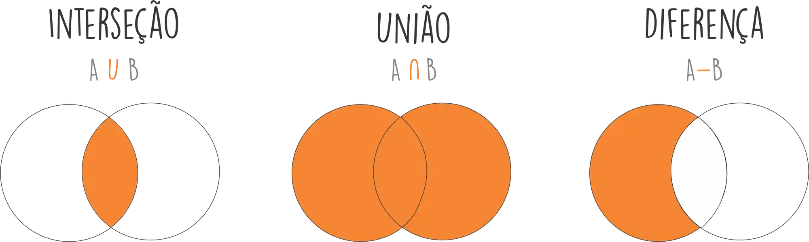

# Repositório de códigos e anotações do curso de python base da linuxtips

## Comandos

### Console

`python -c "comando"`: executa comandos Python no terminal
`python -m site`: módulo que mostra como o Python que está sendo usado está instalado. Para executar outros módulos: `python -m nome_do_modulo`.
`python --version`: mostra versão instalada do Python
`python -VV`: mostra a versão instalada e o momento em que o Python foi compilado.
`python --help`: mostra a guia de ajuda.
`python`: terminal interativo do Python (interpretador).
`python -m turtledemo`: pacote gráfico com exemplos
`which python`: mostra o caminho do python que o sistema está usando.
`mv nome_arquivo nome_novo`: renomeia um arquivo
`env`: mostra a lista de todas as variáveis do ambiente.
`env | grep variavel_ambiente`: grep é uma ferramenta de filtragem do linux.
`export variavel_ambiente`: altera o valor de uma variável de ambiente.
`unset variavel_ambiente`: exclui uma variável de ambiente.
`variavel_ambiente script`: força um script a atualizar um determinado valor de uma determinada variável de ambiente.
`python3.11 -m venv nome_ambiente_virtual`: comando para criar um ambiente virtual.
`source .venv/bin/activate`: comando para ativar um ambiente virtual no Linux bash.
`deactivate`: comando para sair do ambiente virtual

### Funções Python

`bin(numero_inteiro)`: função que mostra a versão binária de determinado número inteiro.
`chr(numero_inteiro)`: função que retorna um caractere referente a um número inteiro.
`id(variavel)`: função que retorna a posição na memória RAM de uma determinada variável.
`type(variavel)`: função que retorna o tipo de dado de uma variável.
`int(valor)`: força a um valor a ser do tipo inteiro.
`dir(tipo_de_dado)`: função que retorna a implementação do objeto, tudo que é possível ser feito com objetido de um determinado tipo de dado.
`str(variavel)`: converte uma variável para String.

`variavel.encode("utf-8")`: retorna um objeto do tipo bytes, onde separado por cada "\" terá um byte formando uma série de bytes que representa um caractere Unicode.
`variavel.decode()`: converte a série de bytes para um caractere Unicode.
`bytes(variavel, "utf-8")`: converte um texto para uma sequência de bytes usando uma tabela específica para buscar o texto.

`len()`: retorna a quantidade de itens dentro de uma sequência materializadas. Método `__len__()`.
`next()`: retorna o próximo item de um objeto composto.
`upper()`: transforma todos os caracteres em maiúsculos.
`lower()`: transforma todos os caracteres em minúsculos.
`capitalize()`: transforma a primeira letra da String em maiúscula.
`title()`: transforma todas as primeiras letras de cada palavra da String em maiúscula.
`split()`: divide um texto em uma lista separadas onde cada espaço é uma palavra.
`startswith("letra")`: verifica se o texto começa com determinada letra, retorna true ou false.
`endswith("letra")`: verifica se determina letra está no final do text, retorna true ou false.
`sorted()`: retorna a ordenação de uma string baseada em uma tabela ASCII.
`reversed()`: retorna uma string ao contrário.
`print("\U0001F43C")`: imprime um emoji com base no seu código Unicode.
`print("\N{panda face})`: imprime um emojo com base no seu nome na tabela Unicode.

`tuple.count("valor")`: informa a quantidade que tem dentro de uma tupla de um determinado valor.

`list.append("Valor")`: adiciona um elemento ao final da lista.
`list.insert(posição, "Valor")`; adiciona um elemento a uma posição específica.
`list.remove("Valor")`: remove um elemento da lista, caso haja mais de um valor igual, ele irá remover o primeiro valor.
`list.pop()`: remove elemento por elemento a partir do fim.
`list1.extend(list2)`: extende/adiciona uma lista a outra.

### Métodos Dunder e Públicos

`__add__()`: implementa o protocolo de adição, sendo um objeto Aditivel. Exemplo: `numero.__add__(1) = numero + 1`.
`__sub__()`: implementa o protocolo de subtração, sendo um objeto redutivel. Exemplo: `numero.__sub__(1) = numero - 1`.
`__mul__()`: implementa o protocolo de multiplicação, sendo um objeto multiplicável. Exemplo: `numero.__mul__(2) = numero * 2`.
`__eq__()`: implementa o protocolo de equalidade. Exemplo: `numero.__eq__(2) = numero == 2`.
`__getitem__()`: habilidade de ser fatiado.
`__contains__`: verifica se possui determinado valor de uma lista ou tupla. Em alguns casos ele pode ser lento. Exemplo: `8 in numeros`

### iPython

`%time função`: comando do iPython que demonstra o uso do CPU para executar determinada função.

## Introdução a programação e ao Python - Day 1

### Linguagens de programação

#### Input e Output (I/O)

__Input:__ envia dados para a unidade computacional, instruções
__Output:__ recebe dados processados do computador, em diversos formatos

__Binário:__ base númerica em que o computador realiza as operações. Basicamente, os dígitos 1 e 0:
1: ligado
0: desligado

- Padronização em formato de bits para se comunicar com a máquina
- Conjunto de 8, 16, 32 bits, formando mensagens específicas
- 8 bits formam 1 byte

__Exemplo:__ letra A = 65 = 01000001

#### Linguagem de programação

Abstração, forma mais natural ao entendimento humano de escrever, aprender e memorizar.

- __Linguagem de baixo nível (Assembly):__ nível mais próximo ao processador/hardware
- __Linguagem de médio nível (C):__ camada nem tanto abstrata e nem tão próxima do processador/hardware
- __Linguagem de alto nível (Python):__ camada mais abstrata, mais fácil para programar.

Uma linguagem de alto nível é convertida para o nível médio e depois então para o baixo nível.

__Linguagens compiladas:__ escreve o programa e o programa precisa estar todo correto do início ao fim. O compilador junta toda a lógica e forma um tipo "pacote" para executar o software. (simplificado)

__Linguagens interpretadas:__ cada comando/linha é interpretado de forma individual.

__O código compilado__ para funcionar em diferentes sistemas operacionais é necessário compilar um pacote para cada sistema.
__O código interpretado__ geralmente é multi plataforma pois ele é interpretado na hora que é executado.

Python é uma linguagem dinâmica e interpretada.

#### Programa

Conjunto de instruções colocados de forma organizada em um ou mais arquivos e que podem ser executados várias vezes obtendo os mesmos resultados. Existem 2 categorias de programas:

- __Programas compilados:__ exigem que todas as linhas de código sejam avaliadas e validadas antes do programa executável ser gerado já na linguagem de máquina e no momento da execução o programa está todo pronto para rodar.
- __Programas interpretados:__ aqueles que podem ser escritos em arquivos mas são avaliados linha a linha, bloco a bloco, sem a necessidade de o programa inteiro estar avaliado, cada instrução é lida e logo em seguida interpreta e executada, tornando mais fácil e mais dinâmica a programação, mas pode ser também mais suscetível a erros.

### Como está organizada a plataforma Python

Python é uma plataforma formada por uma série de componentes.

#### PLR - Python Language Reference

- Documento contendo toda a especificação da linguagem, extenso conjunto de textos escrito pelo criador do Python.
- Regras gramaticais da linguagem.
- Palavras reservadas.
- Todos os comportamentos esperados de uma implementação de Python.

#### Implementação

__CPython__ - Implementação oficial escrita em linguagem C do Python

A partir da PLR se cria uma implementação do Python, essa especificação é programada com o objetivo de interpretar e executar programas Python, como:

- IronPython (.NET)
- Jython (Java Virtual Machine)
- PyPy (escrito em Python para ser mais rápido)
- Stackless Python (CPython com suporte microthreads)
- MicroPython (micro controllers)

#### Ecossistema

Tudo em torno da linguagem Python.

- Comunidades
- PSF (Python Software Foundation)
- Pacotes e ferramentas
- pypi.org (Python Package Index), através da ferramenta `pip` que se instala os pacotes.

### Instalação do Python e preparação do ambiente

Python como uma entidade e você "conversa" com ele, sempre vai ter uma resposta.

Valores que o Python compreende mas não sabe tomar uma ação são chamados de literais.

No interpretador Python, ele sempre vai imprimir os comandos inseridos.

REPL - read-eval-print loop (laço de leitura, execução e impressão)

### Introdução ao git e seu primeiro script Python

Script Python é um arquivo aonde se tem comandos, cada linha para o interpretador é entendido como um comando diferente. Arquivo isolado que pode ser executado isoladamente.

#### Shebang (ambientes Linux)

Comentário especial, sempre na primeira linha, usado para especificar um interpretador específico para o progrmama.

### Criando um programa que lê variáveis de ambiente

#### Variáveis de Ambiente

Termo usado para referir ao local onde o programa é executado, o ambiente em termos gerais é formado por um shell que pode ser entendido como um local isolado onde o seu programa executa.
Neste ambiente existem variáveis que servem para configurar o comportamento do próprio ambiente, do sistema e dos programas que rodam.

__Condicionais:__ define um teste e sempre se usa junto com uma expressão de comparação.

Guia de estilo do python: pep8.org

Manter 80 colunas por linha, uma boa prática.

- __Snake case:__ current_language
- __Pascal Case:__ CurrentLanguage

__Built-in:__ algo que já vem imbutido na linguagem.
__Biblioteca padrão:__ tudo aquilo que já vem instalado por padrão no Python.

### Tipos de instruções: expressions, statements, assignment

Tipos de instruções que podem ser passadas para o interpretador do Python.

- __Expression/Expressão:__ instrução que espera um valor de retorno. Exemplo: 1 + 1
- __Statement/Declaração:__ instrução que prepara o interpretador para uma determinada tarefa mas não retorna valor, normalmente acompanhado de uma expressão. Exemplo: if, else, for, while, pass
- __Assignment/Atribuição:__ intrução que pega o retorno de uma expressão e processa o seu valor com intuito de armazenar. Exemplo: soma = 40 + 2, soma += 3

__Protocolo:__ o que o objeto é capaz de fazer.

#### A precedência de operadores no Python

Além da precedência de operadores aritméticos PEMDAS também existe a tabela de precedência de operadores da própria linguagem:

|   __Nível__  |   __Categoria__   |   __Operadores__   |
|:--------:|:-------------:|:---------------:|
|  7(alto) | Exponenciação |        **       |
|     6    | Multiplicação |     *,/,//,%    |
|     5    |     Adição    |       +,-       |
|     4    |   Relacional  | ==,!=,<=,>=,>,< |
|     3    |     Lógico    |       not       |
|     2    |     Lógico    |       and       |
| 1(baixo) |     Lógico    |        or       |

### Bloco de código e identação

Linguagem fácil de ser entendida por pessoas que não são programadores.

Tarefa: fazer compras
Lista de compras, categorias/blocos

__Blocos de código lógicos:__ possui um escopo definido.
Os ":" inidica um início de um bloco de código, sendo o recúo obrigatório.

__Identação:__ termo usado para a formatação da lista de compras por exemplo, após cada categoria ou seção colocamos um recuo antes de começar o conteúdo.

### Ambientes virtuais e ferramenta iPython

__Ambiente real:__ ambiente onde se encontra o Python do sistema operacional.

#### Ambientes virtuais

- É uma sandbox, é uma cópia de todo o ambiente Python.
- Garante que as dependências e o programa como um todo funcione de forma igual e correta em qualquer computador, evitando conflitos e danos. Cada projeto terá um ambiente virtual.

__Convenção Linux:__ Todo arquivo/pasta que tem um ponto no início é um arquivo/pasta oculto.

__Pip:__ busca pacotes em repositórios para ser instalado no Python. Busca em pypi.org

__iPython:__ interpretador Python com mais ferramentas e colorido.

## Tipos de dados e protocolos - Day 2

### A importância dos tipos de dados e os tipos de dados primitivos

Classe, categoria e tipo são as mesmas coisas. Apesar de terem suas diferenças.

Todo objeto do Python possui as mesmas características, um objeto contém um endereço de memória, que contém um tipo/classe/categoria e um valor.

Através do tipo de dado que o Python consegue saber qual informação você quer, sendo um número, uma letra ou outras coisas.

Através do tipo que é possível converter um dado em uma informação.

#### Tipos de dados primários (Scalar Types)

Utilizados para armazenar uma única unidade de informação como por exemplo um número ou um texto.

- __Métodos públicos:__ métodos que não possuem dunder, podem ser usados diretamente.
- __Protocolos:__ métodos dunder/especiais, determina uma operação que um objeto dentro de um tipo de dado pode tomar, só o Python deve usar, nós devemos usar abstrações que por baixo chamaram esses métodos, exemplos:

#### Tipo de dado Integer

Armazena os números inteiros em Python e é representado pela classe int. Exemplo: `numero = 65`.

#### Tipo de dado Float

- Armazena um valor fracionado, além da parte inteira também armazena o ponto flutuante, a fração, como resultados de divisões. Exemplo: `valor = 5 / 2`.
- A presença de um ponto (".") faz que o Python entenda esse número como um Float.
- Para trabalhar com valores monetários, em uma aplicação de verdade, usa o tipo de dado Decimal ou Currency.

#### Tipo de dado Booleanos

- Armazena um valor True (verdade, 1) ou False (falso, 0). Serve para criação de flags.
- O if só trabalha com valores Booleanos.
- Qualquer número diferente de 0 ou texto não vazio é considerado True para o Python.
- Usado para apresentar uma sintaxe mais bonita. Mas por baixo o Python interpreta 0 como False e 1 como True.

#### Tipo de dado NoneType

- Possui apenas uma única opção de valor, "None", significa nulo, ausência de valor.
- Usado para criar uma variável que não se sabe o valor. Possui um endereçamento de memória e um tipo. O valor da variável pode ser redefinido.
- NoneType é um objeto Singleton, durante toda a execução do código, só pode ser criado apenas uma única vez, só pode existir apenas um único objeto.
- Uma função que não tem um retorno explícito sempre irá retornar um valor NoneType.

O próprio Range é um tipo de dado, ele gera um tipo de dado.
Protocolo Iterable (percorrível), pode percorrer cada um dos seus itens e realizar uma operação. For = Para.

### Textos, Caracteres, Encoding e Strings

- Bytes para Inteiro e Inteiro para Caractere.
- Tipo entre o tipo primário e o tipo composto
- Quando se está armazenando cada uma das letras com seus respectivos butes e sequência posicional em um único objeto, temos o que se chama de Byte Array, no caso do Python se chama String.

__ASCII (American Standard Code for Information Interchange)__ é uma tabela Americana, e por limitação de memória ela só tem 128 (0-127) posições. Deixa de fora muitos caracteres especiais de outras linguas.

__Unicode (Universal Code)__ tabela onde vai existir todos os caracteres existentes. unicode.org

O Python permite imprimir diretamente um caractere na tela.

__Tabela UTF8:__ tabela Unicode que possui 8 bytes para cada posição. Existem caracteres que ocupam mais de 8 bytes.

Em Python, números começados com "0b" são binários e "0x" são hexadecimais.

#### Serialização

Usado para converter um caractere Unicode para uma String de caracteres mais simples, como Hexadecimais, usado para trafegar dados ou armazenar dados.

#### Formatação de textos

##### Concatenação

- Junção de duas Strings em uma. Exemplo: `"Geovanne" + "Padilha"`.
- Tipagem dinâmica, mas tipagem forte, necessita garantir que os tipos de dados são compatíveis.
- Usada na biblioteca logging do Python.

Se tem poucos textos, um texto no começo e um no final, é um bom caso para se utilizar concatenação, mas quando se tem mais blocos de Strings, é bom usar a interpolação.

##### Interpolação (Old Style)

- Uso de template, que vai conter o texto e os placeholder, para ser substituido por dado em uma variável. Exemplo:

`template = "Olá, %s seu saldo é de %f"`.

Para substituir no template usa: `template % (variavel, variavel)`. Os dados sempre inseridos na ordem da esquerda para direita no template.

##### Tipos de placeholder

`%s`: local para ser substituido por um texto, uma String.
`%d`: local para ser substituido por um dígito, um Int.
`%03d`: um dígito sendo exibido com 3 casas decimais.
`%f`: local para ser substituido por um ponto flutuante, um Float.
`%.2f`: ponto flutuante com duas casas decimais.

Pode ser passado diretamente: `"Olá %s" % "Geovanne"`.
Informações sobre formatações no Python: pyformat.info

`%(nome)s`: atribuindo um nome para um placeholder.

Para passar um valor para um placeholder com nome se usa um dicionário. Exemplo: `template = {"nome": nome}`

##### String Format (New Style)

- Usa uma String como um template e substitui as informações na String.
- Usado em mensagens longas.

Em vez da "%" usa as "{}". Exemplo: `msg = "Olá, {} você é o player n {} e você tem {} pontos`.

Para atribuir os valores aos placeholders: `msg.format("Bruno", 2, 987.3)`.

`{:03d}`: específica que é um número inteiro com 3 casas.
`{:.3f}`: específica que é um número de ponto flutuante com 3 casas depois da vírgula.
`{:^11}`: centraliza o texto em um total de 11 caracteres.
`{:<20}`: coloca 20 espaços em branco no total e o texto alinhado a esquerda.
`{:>20}`: coloca 20 espaços em branco no total e o texto alinhado a direita.
`{:-^11}`: preenche os 11 espaços em branco com traços.
`{:#^20.3}`: preenche os espaços em branco com "#", centraliza em 20 caracteres no total e corta 3 caracteres do texto.

Também é possível colocar nomes para os placeholders. Exemplo: `{nome}`.
Para atribuir os valores aos placeholders com nomes: `template.format(nome="Bruno")`.

##### F-Strings - Um String Format melhorado

- Usada para qualquer mensagem, print, erros etc.

Exemplo: `f"Olá {nome} você tem {saldo:.2f}"`

Toda f-string criada deve ter variáveis existentes associadas.
Toda formatação no F-Strings funciona do mesmo jeito que no String Format.

Dentro do bloco de f-string pode ser realizado algumas operações, como: `{n1 * n2}`.

`\n`: quebra de linha no Python

### Tipos de dados Compostos

#### Sequência (Sequence)

- Um só objeto na memória que pode ser atribuído um nome, e dentro desse objeto terá posições para cada objeto.
- O objeto sequência não vai ter valor para cada objeto dentro dele, mas sim referências, apontandos para determinados espaços na memória que contém os dados.

O tipo composto é um agrupamento onde dentro dele será guardado referências para múltiplos objetos

#### Tuplas (Tuple)

Exemplo: `dados = "Bruno", 2, 3.50, True`

Tipo composto mais simples e bastante comum no Python.
Cria uma sequência de valores que podem ser de qualquer tipo. Pode ser criado com ou sem parênteses.
Sempre que um ou mais objetos forem encadeados com `,`, isso será interpretado como um objeto do tipo tupla.
É imutável, após ser criada os valores dentro dela não podem ser alterados ou adicionados novos valores.

`dados[-1]`: subscrição, com o método de acesso pelo índice, sendo possível da frente `dados[0]` ou de trás `dados[-2]`.
Também é possível fatiar uma Tupla. Exemplo: `dados[1:3]`

##### Desempacotamento (Unpacking, Spread, Explode)

```python
# Empacotamento (atribuição)
coord = 140, 200, 9

# Desempacotamento (atribuição múltipla)
x, y, z = coord
```

Desempacotar cada valor de uma Tupla em variáveis separadas. Desempacota da esquerda para a direita

Selecionar apenas o valor desejado: `x, *_ = pontos`. Nesse caso, o Python vai colocar o primeiro valor em "x" e o restante no "_" (underline).
Selecionar apenas o primeiro e o último elemento: `x, *_, y = coord`

#### Listas (Lists)

- Objeto mais padrão para se tratar de sequência.
- As listas são mais flexíveis, podendo ser comparadas com arrays ou vetores.
- Pode ser criada vazia ou com elementos, por ser mutável, possui tamanho dinâmico, podendo remover ou adicionar novos elementos e reordenação.
- Tudo que é possível fazer com a Tupla, também é possível ser feito com a Lista.

Meios para criar uma lista:

```python
# Uso de colchetes, maneira mais usada.
list = []

# Uso da classe List
list = list()
```

Possibilidade de somar listas ou tuplas. Exemplo:

```python
nomes1 = ["Geovanne", "Alice"]
nomes2 = ["Beatriz", "Maria"]

nomes1 + nomes2
# ["Geovanne", "Alice", "Beatriz", "Maria"]

# Usando extend(), extende/adiciona uma lista a outra.
nomes1.extend(nomes2)
# nomes1 = ["Geovanne", "Alice", "Beatriz", "Maria"]

# Outra forma de adicionar uma lista ao fim de outra lista
nomes1 += ["Marcos"]
# nomes1 = ["Geovanne", "Alice", "Beatriz", "Maria", "Marcos"]
```

Método contains. Exemplo:

```python
numeros = [0, 4, 8, 12, 16, 20]

8 in numeros
# True

2 in numeros
# False
```

#### Exercício com listas, tuplas, loops e condicionais

Código do Exercício:

```python
#!/usr/bin/env python3
"""Exibe relatório de crianças por atividade

Imprimir a lista de crianças agrupadas por sala que frequentam
cada uma das atividades.
"""
__version__ = "0.1.0"
__author__ = "Giovanni Padilha"

# Dados
sala1 = ["Erik", "Maia", "Gustavo", "Manuel", "Sofia", "Joana"]
sala2 = ["João", "Antônio", "Carlos", "Maria", "Isolda"]

aula_ingles = ["Erik", "Maia", "Joana", "Carlos", "Antônio"]
aula_musica = ["Erik", "Carlos", "Maria"]
aula_danca = ["Gustavo", "Sofia", "Joana", "Antônio"]

atividades = [
    ("Inglês", aula_ingles), 
    ("Música", aula_musica), 
    ("Dança", aula_danca),
]

# Listar alunos em cada atividade por sala
for nome_atividade, atividade in atividades:

    atividade_sala1 = []
    atividade_sala2 = []
    
    for aluno in atividade:
        if aluno in sala1:
            atividade_sala1.append(aluno)
        elif aluno in sala2:
            atividade_sala2.append(aluno)

    print(f"Alunos de {nome_atividade} da Sala 1:", atividade_sala1)
    print(f"Alunos de {nome_atividade} da Sala 2:", atividade_sala2)
    print("-" * 10)
```

#### Conjuntos (Sets) e a teoria dos conjuntos

- Cria uma coleção de objetos desordenados mas possui objetos únicos.
- Pode ser criado vazio.

Para criar um conjunto explicitamente:

```python
# Um conjunto criado com objeto iterável criado dentro dele.
conjunto = set(objeto_iteravel)
```

Adicionar novos elementos:

```python
conjunto.add(elemento)
```

- Implementa uma Hash Table, que resolve a complexidade algorítmica em buscas de uma coleção.
  - Quando uma operação precisa ser executada muitas vezes em uma coleção, ela é denominada O(n).
  - Quando uma operação precisa ser executada em um conjunto (set) no Python, por conta da Hash Table, o Python sabe exatamente aonde o elemento está, sendo muito mais rápido, denominada O(1) - constante.

##### Operações com Conjuntos



###### União

- Retorna a união dos elementos de um set A e um set B em um único set

```python
conjunto_a = set([1, 2, 3, 4, 5])
conjunto_b = set([4, 5, 6, 7, 8])

set(conjunto_a) | set(conjunto_b)
# {1, 2, 3, 4, 5, 6, 7, 8}

# ou

conjunto_a.union(conjunto_b)
# {1, 2, 3, 4, 5, 6, 7, 8}
```

###### Intersecção

- Retorna os elementos que aparecem simultaneamente em um set A e um set B.

```python
conjunto_a = set([1, 2, 3, 4, 5])
conjunto_b = set([4, 5, 6, 7, 8])

set(conjunto_a) & set(conjunto_b)
# {4, 5}

# ou

conjunto_a.intersection(conjunto_b)
# {4, 5}
```

###### Diferença

Possui dois casos:

- A - B: retorna os elementos que estão no conjunto A mas não estão no conjunto B
- B - A: retorna os elementos que estão no conjunto B mas não estão no conjunto A

```python

# A - B

conjunto_a = set([1, 2, 3, 4, 5])
conjunto_b = set([4, 5, 6, 7, 8])

set(conjunto_a) - set(conjunto_b)
# {1, 2, 3}

# ou

conjunto_a.difference(conjunto_b)
# {1, 2, 3}

# B - A

conjunto_a = set([1, 2, 3, 4, 5])
conjunto_b = set([4, 5, 6, 7, 8])

set(conjunto_b) - set(conjunto_a)
# {6, 7, 8}

# ou

conjunto_b.difference(conjunto_a)
# {6, 7, 8}
```

###### Diferença Simétrica

- Retorna todos os elementos que estão apenas em A e todos os elementos que estão apenas em B.

```python
conjunto_a = set([1, 2, 3, 4, 5])
conjunto_b = set([4, 5, 6, 7, 8])

set(conjunto_a) ^ set(conjunto_b)
# {1, 2, 3, 6, 7, 8}

# ou

conjunto_a.symmetric_difference(conjunto_b)
# {1, 2, 3, 6, 7, 8}
```

#### Dicionários

- Conhecidos também como HashMaps ou Arrays Associativos.
- Supertipo de dado que possui características parecidas com um misto do Set e da List.
- Objeto mutável, permite inserir elementos.
- Objeto iterável, permite percorrer os elementos
- Implementa a Hash Table
- Ele guarda duas informações de qualquer tipo por espaço: key -> value, mas não permite chaves duplicadas.

Sintaxe de criação de um dicionário:

```python
# Criando com apenas as chaves
dictionary = {}

# Criando com a função dict()
dictionary = dict()

# Pode ser criado com valores
dictionary = {"nome": "Geovanne", "cod": 123}
```

- As chaves devem ser objetos que possui suporte para Hash Table

Acessar objetos dentro do dicionário:

```python
cliente = {"nome": "Geovanne", "cod": 123}

# O objeto é acessado através da chave (key)
cliente["nome"]
```

Possível inserir novas chaves com novos valores:

```python
cliente = {"nome": "Geovanne", "cod": 123}

# Forma para adicionar uma nova chave com valor ao dicionário já existente
cliente["cidade"] = "Viana"
```

Remover objetos dentro do dicionário:

```python
cliente = {"nome": "Geovanne", "cod": 123}

# Excluir o nome do cliente, ficando apenas o cod
del cliente["nome"]
```

Verificar se um objeto existe dentro do dicionário:

```python
cliente = {"nome": "Geovanne", "cod": 123}

"cod" in cliente
# True

"cidade" in cliente
# False
```

- Caso a busca for baseada na chave, a busca será rápida, mas caso seja baseada no valor, a busca não será tão rápido, para isso seria necessário criar um algoritmo de busca de árvore invertida.

Forma de acessar chaves e valores de forma separada:

```python
cliente = {"nome": "Geovanne", "cod": 123}

# Acessar apenas as chaves do dicionário
cliente.keys()

# Acessar apenas os valores do dicionário
cliente.values()

# Acessar as chaves com os valores em forma de Tupla
cliente.items()
```

Forma de juntar dicionários:

```python
cliente = {"nome": "Geovanne", "cod": 123}
extra = {"pais": "Portugal"}

# Junção das chaves e valores de um dicionário em um outro dicionário
cliente.update(extra)
```

Desempacotamento de dicionários, criando um novo dicionário a partir de outros dois (Sintaxe nova do Python 3):

```python
cliente = {"nome": "Geovanne", "cod": 123}
extra = {"pais": "Portugal"}

# Desempacotamento em um novo dicionário
final = {**extra, **cliente}
# final = {"pais": "Portugal", "nome": "Geovanne", "cod": 123}
```

##### Observação sobre desempacotamento no Python 3

- Para passar algo para um objeto e desempacotar ao mesmo tempo, no Python 3, é utilizado os asteristicos (*)
- Para objetos com um único elemento em cada posição usa apenas um asterístico (*)
- Para objetos com mais de um elemento em cada posição usa dois asterísticos (**)

```python
# Desempacotamento de sequências com um único elemento em cada posição
clientes = ["Maria", "João", "Bruno"]

primeiro_cliente, *_ = clientes
# primeiro_cliente = "Maria"
# _ = ["João", "Bruno"]

# Desempacotamento de sequências com mais de um elemento em cada posição (dicionário)
cliente = {"nome": "Geovanne", "cod": 123}
extra = {"pais": "Portugal"}

final = {**extra, **cliente}
# final = {"pais": "Portugal", "nome": "Geovanne", "cod": 123}
```

- Quando se itera por padrão em um dicionário, retorna apenas as chaves.

Acessar uma chave, podendo dar um valor padrão a chave caso ela não exista, para contornar o erro:

```python

# Função para acessar um campo do dicionário através da chave e caso não existir, será passado um valor padrão
dictionary.get(key, default_value)
```

__Builtins:__ Módulo com as funções onde dentro dele tem um dicionário com todas as funções do Python.

##### Refatorando o Hello World usando dicionários

Código:

```python
__version__ = "0.1.2" # Metadado que determina a versão do programa.
__author__ = "Geovanne" # Metadado que determina o nome do autor do programa.
__license__ = "Unlicense" # Metadado que determina o tipo de licença do programa.

import os # Biblioteca usado para que o Python se comunique com o SO.

current_language = os.getenv("LANG", "en_US")[:5] # Comando para obter o valor de uma variável de ambiente, contendo um valor padrão "en_US" e sendo fatiada a partir do primeiro caractere até o quinto. [:5]

msg = {
    "en_US": "Hello, World!",
    "pt_BR": "Olá, Mundo!",
    "it_IT": "Ciao, Mondo!",
    "es_SP": "Hola, Mundo!",
    "fr_FR": "Bonjour, Monde!",
}

print(msg[current_language]) # Função de imprimir algo na tela (output)
```

### Desafio com estruturas de dados

Versão do programa que separa os alunos da escola por sala e atividades feita usando dicionários:

```python
__version__ = "0.1.1"
__author__ = "Giovanni Padilha"

# Dados
salas = {
    "Sala-1": [
        "Erik",
        "Maia",
        "Gustavo",
        "Manuel",
        "Sofia",
        "Joana",
    ],
    "Sala-2": [
        "João",
        "Antônio",
        "Carlos",
        "Maria",
        "Isolda",
    ],
}

atividades = {
    "Inglês": [
        "Erik",
        "Maia",
        "Joana",
        "Carlos",
        "Antônio",
    ],
    "Música": [
        "Erik",
        "Carlos",
        "Maria",
    ],
    "Dança": [
        "Gustavo",
        "Sofia",
        "Joana",
        "Antônio",
    ],
}

# Listar de uma sala que tem interseção com uma atividade

for atividade in atividades:
    for sala in salas:
        alunos = set(salas[sala]) & set(atividades[atividade])
        print(f"Alunos de {atividade} da {sala}: ", alunos)
    print("-" * 50)    
```
